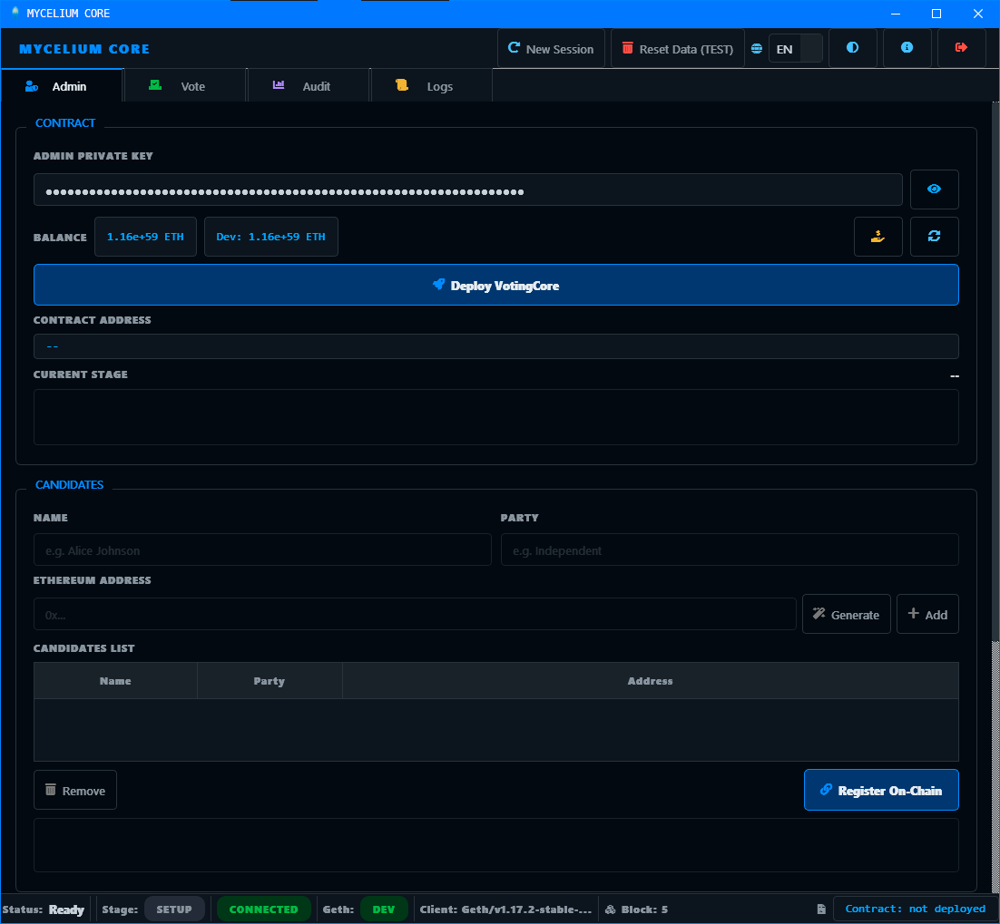
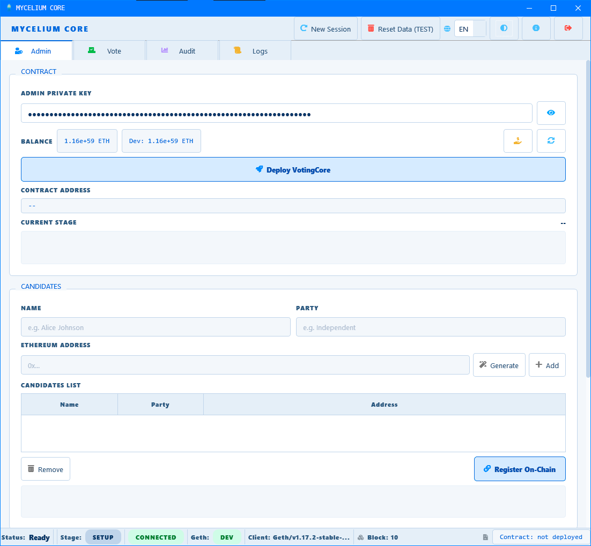
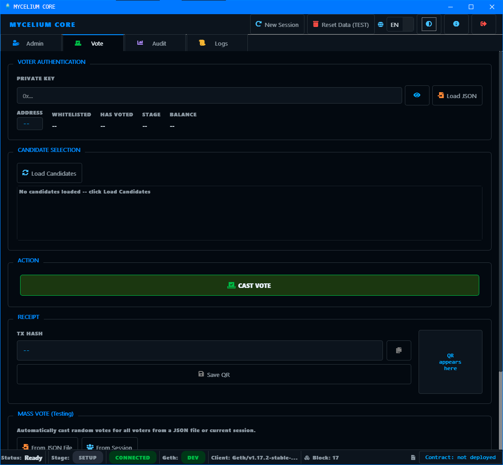
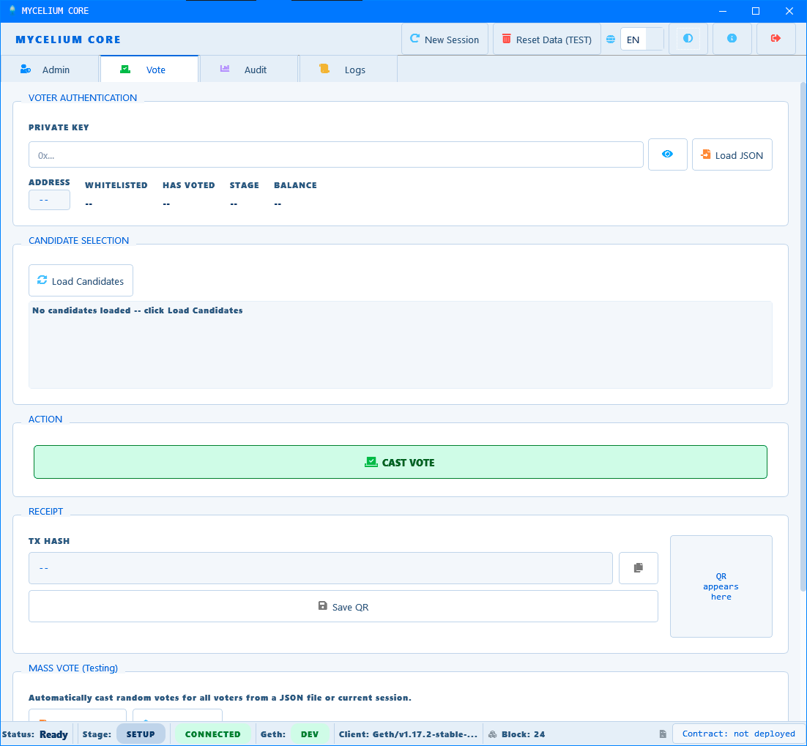
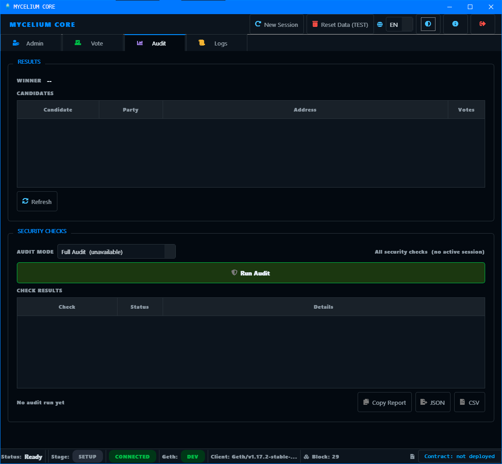
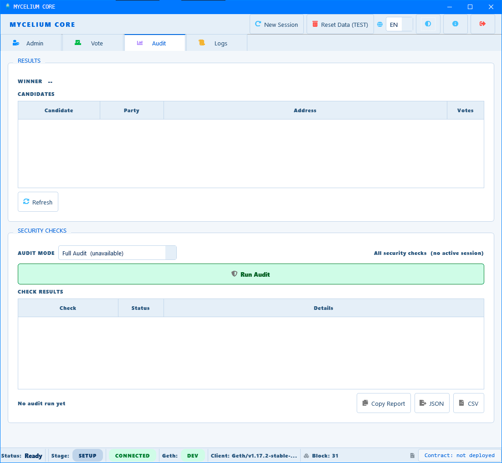
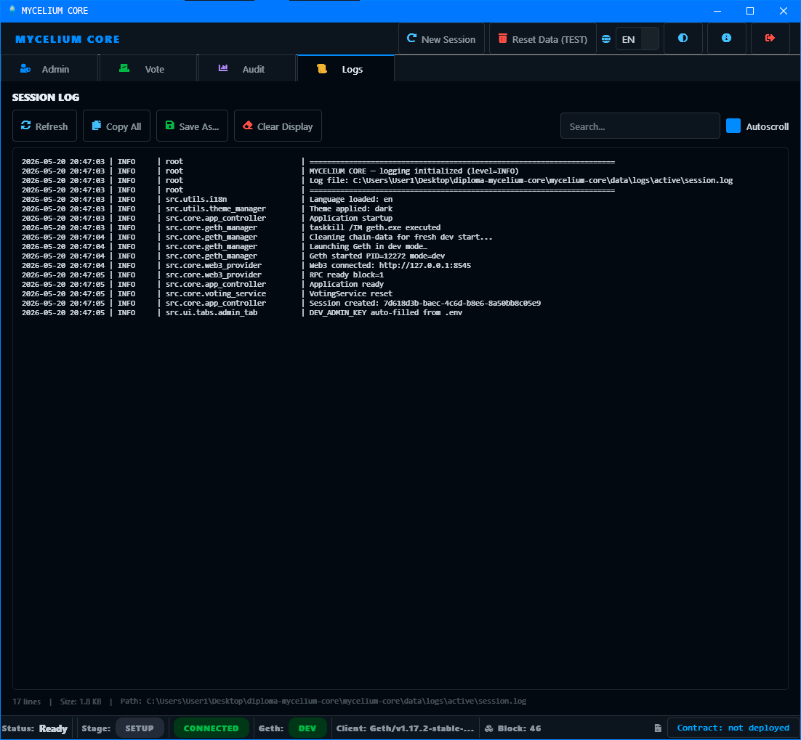
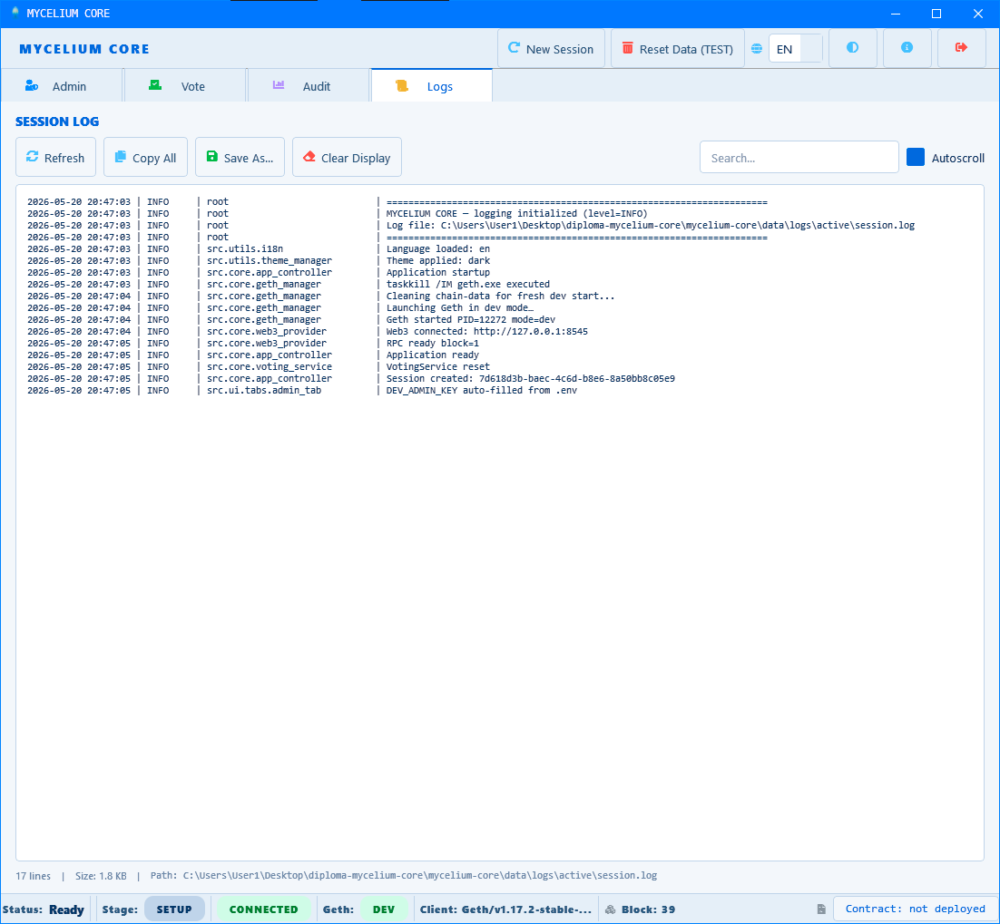
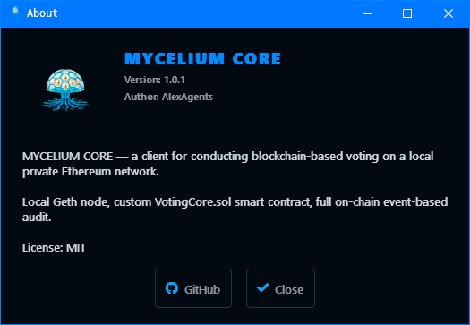
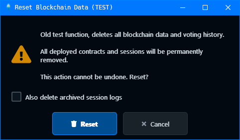

<div align="center">


# MYCELIUM CORE

> Desktop sandbox for modeling, executing, and auditing
> blockchain-based voting on a local Ethereum network.
> A simulator built as a diploma project.

[](https://github.com/AlexAgents/mycelium-core/releases) [](LICENSE)     [](https://github.com/AlexAgents/mycelium-core/tree/main/docs) [](https://www.figma.com/design/PWzJmLP7TrrbjcL6F85KoU/mycelium-core)

[](README.md)
[](README.en.md)

**[Artifacts](#artifacts)** · **[Architecture](#architecture)** · **[Design](#design)** · **[Screenshots](#screenshots)** · **[Quick Start](#quick-start)** · **[Configuration](#configuration)** · **[Security](#security-invariants)** · **[FAQ](docs/src/reference/faq.md)**

</div>

---

## Overview

MYCELIUM CORE is a standalone desktop environment designed to simulate
a blockchain-based voting process. The system uses a single Solidity
smart contract (`VotingCore.sol`) as the absolute source of truth, an
ephemeral local Geth node for execution, and a layered PyQt6 graphical
interface.

The project demonstrates the complete lifecycle of on-chain elections,
including preparation, voting, and event-driven cryptographic auditing.

## Artifacts

<table>
<tr>
<th nowrap>Category</th>
<th nowrap>Artifact</th>
<th nowrap>Count</th>
<th>Link</th>
</tr>
<tr>
<td nowrap>Documentation</td>
<td>MkDocs Site (EN/RU)</td>
<td nowrap>70+ pages</td>
<td><a href="docs/src/index.md">Open</a></td>
</tr>
<tr>
<td nowrap>UML Diagrams</td>
<td>Component, Class, Sequence, State, Activity, UseCase, Deployment, C4</td>
<td nowrap>17</td>
<td><a href="docs/src/diagrams/index.md">Catalog</a></td>
</tr>
<tr>
<td nowrap>BPMN Processes</td>
<td>Setup, Voting, Mass Vote, Audit, Error Handling, Session Lifecycle</td>
<td nowrap>6</td>
<td><a href="docs/src/diagrams/index.md">Catalog</a></td>
</tr>
<tr>
<td nowrap>ADR</td>
<td>ADR-001 through ADR-007</td>
<td nowrap>7</td>
<td><a href="docs/src/architecture/overview.md">Overview</a></td>
</tr>
<tr>
<td nowrap>Security</td>
<td>STRIDE Threat Model + SEC-01..06</td>
<td nowrap>7</td>
<td><a href="docs/src/security/threat-model.md">Threats</a></td>
</tr>
<tr>
<td nowrap>API Reference</td>
<td>Core module specifications</td>
<td nowrap>10</td>
<td><a href="docs/src/api/index.md">API</a></td>
</tr>
<tr>
<td nowrap>UI Mockups</td>
<td>Figma file with annotation notes</td>
<td nowrap>53 notes</td>
<td><a href="https://www.figma.com/design/XXXXXXXXX/mycelium-core">Figma</a></td>
</tr>
<tr>
<td nowrap>Design System</td>
<td>Colors, typography, components</td>
<td nowrap>6 pages</td>
<td><a href="docs/src/ui-design/design-system.md">Design</a></td>
</tr>
<tr>
<td nowrap>SRS</td>
<td>Project + Documentation SRS</td>
<td nowrap>2</td>
<td><a href="docs/src/reference/srs.md">SRS</a></td>
</tr>
<tr>
<td nowrap>Tests</td>
<td>Unit + Integration (real Geth)</td>
<td nowrap>180 passed</td>
<td><a href="docs/src/development/testing.md">Testing</a></td>
</tr>
<tr>
<td nowrap>Glossary</td>
<td>Terms and abbreviations</td>
<td nowrap>33 terms</td>
<td><a href="docs/src/reference/glossary.md">Glossary</a></td>
</tr>
<tr>
<td nowrap>FAQ</td>
<td>Common questions</td>
<td nowrap>16</td>
<td><a href="docs/src/reference/faq.md">FAQ</a></td>
</tr>
</table>

## Architecture

The system enforces a strict layered architecture. The Presentation
Layer (UI) is prohibited from importing Web3, Solidity, or cryptography
libraries directly.

```text
┌─────────────────────────────────────┐
│  UI Layer (PyQt6 Widgets + Workers) │
└──────────────┬──────────────────────┘
               ▼
┌─────────────────────────────────────┐
│  AppController (Facade)             │
└──────────────┬──────────────────────┘
               ▼
┌─────────────────────────────────────┐
│  Services (Voting / Audit / Error)  │
└──────────────┬──────────────────────┘
               ▼
┌─────────────────────────────────────┐
│ Infrastructure (Web3 / Geth / Nonce)│
└──────────────┬──────────────────────┘
               ▼
┌─────────────────────────────────────┐
│  VotingCore.sol (Smart Contract)    │
└─────────────────────────────────────┘
```

## Design

UI mockups with a complete annotation system are maintained in Figma.

**[View Figma file (read-only)](https://www.figma.com/design/PWzJmLP7TrrbjcL6F85KoU/mycelium-core)**

The file contains:
- 4 tab mockups (Admin, Vote, Audit, Logs)
- 5 dialog types (New Session, Mass Vote, Funding, Exit, Reset)
- Variative components (StatusBadge, Toast, ProgressBar, LogBox)
- 53 annotation notes with color-coded categories
- Pin markers linking notes to interface elements

Full specification: [Design System](docs/src/ui-design/design-system.md) |
[Color Palette](docs/src/ui-design/color-palette.md) |
[Figma Structure](docs/src/ui-design/figma-mockups.md)

## Screenshots

<details>
<summary>Admin Tab — contract deployment, candidates, voters, stage control</summary>

<br>

<table>
<tr>
<th align="center">Dark Theme</th>
<th align="center">Light Theme</th>
</tr>
<tr>
<td align="center">

</td>
<td align="center">

</td>
</tr>
</table>

</details>

<details>
<summary>Vote Tab — voter authentication, candidate selection, QR receipt</summary>

<br>

<table>
<tr>
<th align="center">Dark Theme</th>
<th align="center">Light Theme</th>
</tr>
<tr>
<td align="center">

</td>
<td align="center">

</td>
</tr>
</table>

</details>

<details>
<summary>Audit Tab — SEC-checks, results, export</summary>

<br>

<table>
<tr>
<th align="center">Dark Theme</th>
<th align="center">Light Theme</th>
</tr>
<tr>
<td align="center">

</td>
<td align="center">

</td>
</tr>
</table>

</details>

<details>
<summary>Logs Tab — session log, live search, autoscroll</summary>

<br>

<table>
<tr>
<th align="center">Dark Theme</th>
<th align="center">Light Theme</th>
</tr>
<tr>
<td align="center">

</td>
<td align="center">

</td>
</tr>
</table>

</details>

<details>
<summary>Dialogs — About, Reset Blockchain</summary>

<br>

<table>
<tr>
<th align="center">About Dialog</th>
<th align="center">Reset Blockchain Dialog</th>
</tr>
<tr>
<td align="center">

</td>
<td align="center">

</td>
</tr>
</table>

</details>

## Quick Start

### 1. Prerequisites

- Python 3.11+
- [Go-Ethereum (Geth)](https://geth.ethereum.org/downloads/) binary
  placed in the `mycelium-core/bin/` directory
  (`bin/geth.exe` for Windows, `bin/geth` for Linux/macOS).

### 2. Installation

```bash
git clone https://github.com/AlexAgents/mycelium-core.git
cd mycelium-core/mycelium-core
python -m venv venv

# Windows
venv\Scripts\activate
# Linux/macOS
# source venv/bin/activate

pip install -r requirements.txt
cp .env.example .env
```

### 3. Run Application

```bash
python main.py
```

### 4. Run Documentation (MkDocs)

To render UML diagrams locally, download
[`plantuml.jar`](https://github.com/plantuml/plantuml/releases/) and
place it inside the `docs/` directory.

```bash
cd ../../docs
pip install -r requirements-docs.txt
mkdocs serve
# Open http://127.0.0.1:8000
```

## Configuration

All runtime parameters are configured via `.env`.
Copy `.env.example` to `.env` and adjust as needed.

### Geth modes

The application runs Geth in `--dev` mode only. This is by design
(see [ADR-002](docs/src/architecture/decisions/adr-002-geth-dev-mode.md)).

<table>
<tr>
<th nowrap>Parameter</th>
<th nowrap>Default</th>
<th>Description</th>
</tr>
<tr>
<td nowrap><code>RPC_HOST</code></td>
<td nowrap><code>127.0.0.1</code></td>
<td nowrap>Geth JSON-RPC host</td>
</tr>
<tr>
<td nowrap><code>RPC_PORT</code></td>
<td nowrap><code>8545</code></td>
<td nowrap>Geth JSON-RPC port</td>
</tr>
<tr>
<td nowrap><code>GETH_NETWORK_ID</code></td>
<td nowrap><code>1337</code></td>
<td nowrap>Local network ID</td>
</tr>
</table>

### Transaction parameters

<table>
<tr>
<th nowrap>Parameter</th>
<th nowrap>Default</th>
<th>Description</th>
</tr>
<tr>
<td nowrap><code>DEFAULT_GAS</code></td>
<td nowrap><code>500000</code></td>
<td nowrap>Gas limit per transaction</td>
</tr>
<tr>
<td nowrap><code>DEFAULT_GAS_PRICE</code></td>
<td nowrap><code>1000000000</code></td>
<td nowrap>Gas price in Wei (1 Gwei)</td>
</tr>
</table>

### UI timing parameters

These are hardcoded constants — change in source if needed:

<table>
<tr>
<th nowrap>Constant</th>
<th nowrap>File</th>
<th nowrap>Default</th>
<th>Description</th>
</tr>
<tr>
<td nowrap><code>_TOAST_DURATION_MS</code></td>
<td nowrap><code>toast.py</code></td>
<td nowrap><code>2500</code></td>
<td nowrap>Toast visible duration (ms)</td>
</tr>
<tr>
<td nowrap><code>_TOAST_GAP_MS</code></td>
<td nowrap><code>toast.py</code></td>
<td nowrap><code>150</code></td>
<td nowrap>Gap between toasts (ms)</td>
</tr>
<tr>
<td nowrap><code>--dev.period</code></td>
<td nowrap><code>geth_manager.py</code></td>
<td nowrap><code>5</code></td>
<td nowrap>Seconds between blocks</td>
</tr>
<tr>
<td nowrap><code>RPC_WAIT_TIMEOUT_SEC</code></td>
<td nowrap><code>web3_provider.py</code></td>
<td nowrap><code>30</code></td>
<td nowrap>RPC connection timeout (s)</td>
</tr>
<tr>
<td nowrap><code>timeout</code></td>
<td nowrap><code>voting_service.py</code></td>
<td nowrap><code>120</code></td>
<td nowrap>TX confirmation timeout (s)</td>
</tr>
</table>

### Dev mode

<table>
<tr>
<th nowrap>Parameter</th>
<th nowrap>Default</th>
<th>Description</th>
</tr>
<tr>
<td nowrap><code>DEV_MODE</code></td>
<td nowrap><code>true</code></td>
<td nowrap>Enables dev conveniences</td>
</tr>
<tr>
<td nowrap><code>DEV_ADMIN_KEY</code></td>
<td nowrap><em>(empty)</em></td>
<td nowrap>Auto-fills admin key field</td>
</tr>
<tr>
<td nowrap><code>LOG_LEVEL</code></td>
<td nowrap><code>INFO</code></td>
<td nowrap>DEBUG / INFO / WARNING</td>
</tr>
<tr>
<td nowrap><code>SOLIDITY_VERSION</code></td>
<td nowrap><code>0.8.20</code></td>
<td nowrap>Solidity compiler version</td>
</tr>
</table>

## Security Invariants

Critical business rules are enforced proactively on-chain and verified
reactively off-chain via `AuditService`:

<table>
<tr>
<th nowrap>Code</th>
<th nowrap>Check</th>
<th nowrap>On-Chain</th>
<th nowrap>Audit</th>
</tr>
<tr>
<td nowrap>SEC-01</td>
<td nowrap>Double Vote</td>
<td nowrap><code>hasVoted[sender]</code></td>
<td nowrap>No duplicate events</td>
</tr>
<tr>
<td nowrap>SEC-02</td>
<td nowrap>Whitelist</td>
<td nowrap><code>require(whitelist[sender])</code></td>
<td nowrap>All voters whitelisted</td>
</tr>
<tr>
<td nowrap>SEC-03</td>
<td nowrap>Stage</td>
<td nowrap><code>onlyStage(Active)</code></td>
<td nowrap>Votes in valid block range</td>
</tr>
<tr>
<td nowrap>SEC-04</td>
<td nowrap>Candidates</td>
<td nowrap><code>require(candidates[c].registered)</code></td>
<td nowrap>Votes target registered</td>
</tr>
<tr>
<td nowrap>SEC-05</td>
<td nowrap>Owner</td>
<td nowrap><code>onlyOwner</code> modifier</td>
<td nowrap>Admin TX from owner</td>
</tr>
<tr>
<td nowrap>SEC-06</td>
<td nowrap>Integrity</td>
<td nowrap>implicit <code>votes += 1</code></td>
<td nowrap>Events = sum of votes</td>
</tr>
</table>

## License

Distributed under the **MIT** License. See [LICENSE](LICENSE) for details.

**Author:** AlexAgents