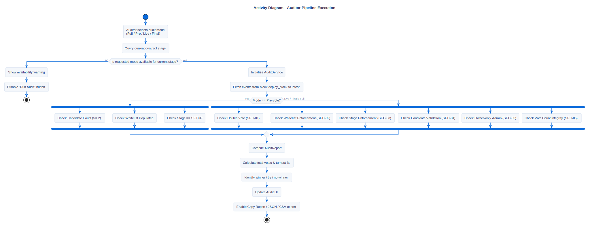

# Auditor Pipeline Process

## Description
This activity diagram describes the internal validation pipeline
executed when the Auditor runs a security check.

`AuditService` supports four execution modes — **Full**, **Pre-vote**,
**Live**, **Final** — each enabled or disabled depending on the
current contract stage. The mode determines which subset of SEC-checks
runs. See [Security Checks](../../security/sec-checks.md) for the full
specification of SEC-01..06 invariants.

## Diagram

## Note / Architectural Decision
**Why we designed it this way:**

- **Mode-aware execution:** Some checks (e.g. `Double Vote Protection`)
  are meaningless before voting starts, others (e.g. `Stage Enforcement`)
  require block-level data only available after `VotingFinished`.
  The mode selector prevents auditors from drawing false conclusions
  from incomplete data.

- **Independent verification:** Audit reads `VoteCast`, `VotingStarted`,
  `VotingFinished`, `StageChanged`, `CandidateAdded`, `VoterWhitelisted`
  events directly from the chain and rebuilds counts independently of
  the contract's `vote_count` storage. `SEC-06 Vote Count Integrity`
  compares the two — divergence would indicate either a contract bug
  or chain tampering.

## References

- **Code:** `src/core/audit_service.py`
- **Security Spec:** [Security Checks SEC-01..06](../../security/sec-checks.md)
- **Source:** `src/diagrams/sources/uml/activity/audit-process.puml`