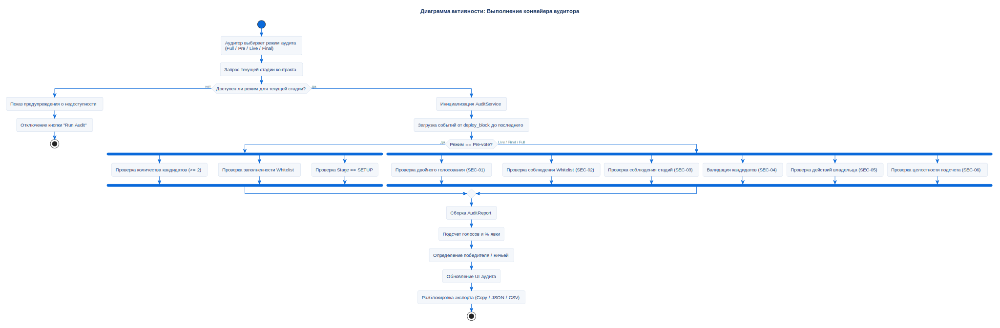

# Конвейер аудита безопасности

## Описание
Эта диаграмма активности описывает внутренний процесс проверок,
выполняемый конвейером `AuditService` при запуске аудита.

`AuditService` поддерживает четыре режима — **Full**, **Pre-vote**,
**Live**, **Final** — каждый из которых доступен или заблокирован
в зависимости от текущей стадии контракта. Режим определяет, какое
подмножество SEC-проверок выполняется. Полная спецификация инвариантов
SEC-01..06 описана в разделе [Проверки безопасности](../../security/sec-checks.md).

## Диаграмма

## Нота / Архитектурное решение
**Почему спроектировано именно так:**

- **Режим зависит от стадии:** Часть проверок (например, `Double Vote
  Protection`) бессмысленна до начала голосования, другие (например,
  `Stage Enforcement`) требуют данных о номерах блоков, доступных
  только после `VotingFinished`. Селектор режима предотвращает ложные
  выводы аудитора на основе неполных данных.

- **Независимая верификация:** Аудит читает события `VoteCast`,
  `VotingStarted`, `VotingFinished`, `StageChanged`, `CandidateAdded`,
  `VoterWhitelisted` напрямую из цепи и пересчитывает голоса независимо
  от поля `vote_count` в контракте. Проверка `SEC-06 Vote Count
  Integrity` сравнивает оба источника — расхождение указывало бы либо
  на баг в контракте, либо на подмену данных в цепи.

## Ссылки

- **Код:** `src/core/audit_service.py`
- **Спецификация:** [Проверки безопасности SEC-01..06](../../security/sec-checks.md)
- **Источник:** `src/diagrams/sources/uml/activity/audit-process.puml`