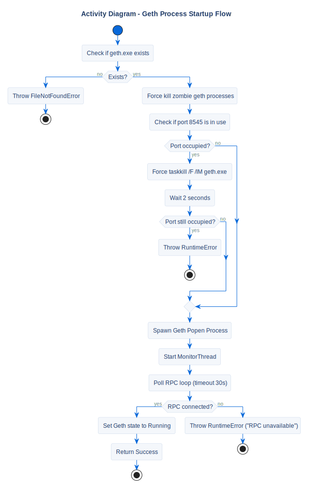

# Geth Startup Flow

## Description
This activity diagram outlines the startup procedure, port verification, and taskkill safety nets.

## Diagram

## References

- **Code:** `src/core/geth_manager.py`
- **Source:** `src/diagrams/sources/uml/activity/geth-startup.puml`
- **Note:** If the node starts but RPC doesn't answer within 30 seconds, it raises `RuntimeError("Ethereum RPC unavailable")`.