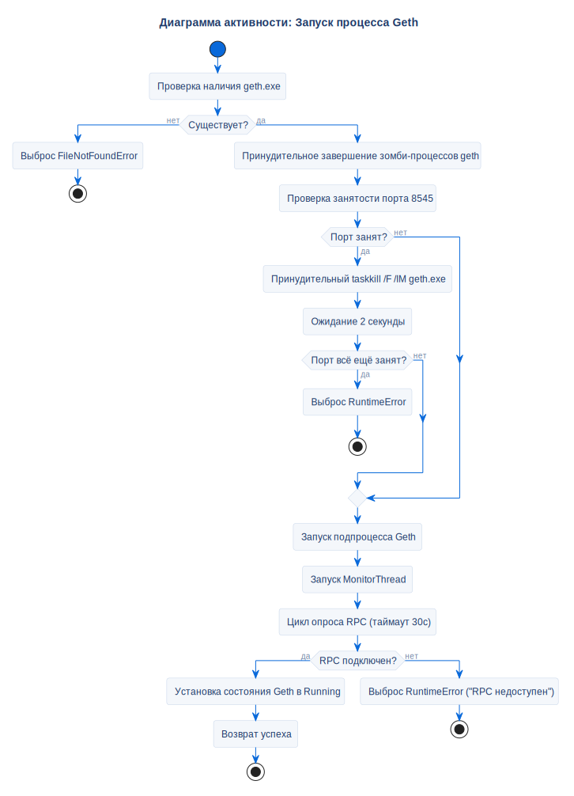

# Запуск процесса Geth

## Описание
Эта диаграмма активности описывает процедуру автоматического запуска Geth, верификацию доступности портов и принудительное завершение старых зависших процессов.

## Диаграмма

## Ссылки

- **Код:** `src/core/geth_manager.py`
- **Источник:** `src/diagrams/sources/uml/activity/geth-startup.puml`
- **Примечание:** Если узел запускается, но RPC не отвечает в течение 30 секунд, генерируется `RuntimeError("Ethereum RPC unavailable")`.