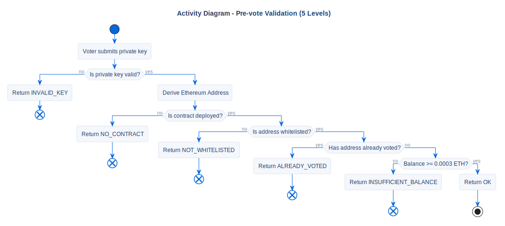

# Pre-vote Validation Flow

## Description
This activity diagram maps the 5-level algorithmic pipeline executed by the application before allowing a vote transaction to be broadcasted to the network.

## Diagram

## Architectural Intent
**Why we designed it this way:**

- **Cost Optimization Logic:** Blockchain transactions cost "Gas" even if they fail. This pipeline checks conditions locally to prevent sending doomed transactions. 
- **Resource-Aware Ordering:** The checks are ordered by computational cost:
  1. *Local checks first* (Is the private key format valid? Is a contract deployed?).
  2. *Read-only RPC checks second* (Is the voter in the whitelist? Have they already voted?).
  3. *Balance check last* (Does the account have enough ETH to pay the gas fee?).
- **Error Handling:** Instead of letting the smart contract throw a generic `revert` error, this pipeline intercepts the failure early and maps it to a specific `PrecheckStatus` enum, allowing the UI to show a precise, localized warning.

## References

- **Code:** `src/core/precheck.py`
- **Source:** `src/diagrams/sources/uml/activity/precheck-vote.puml`