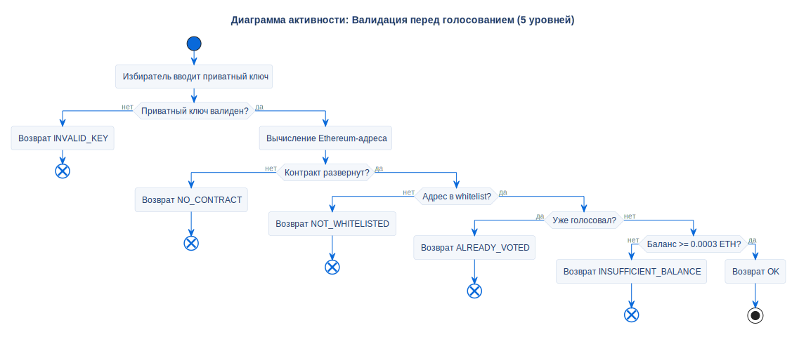

# Валидация перед голосованием

## Описание
Эта диаграмма активности отображает 5-уровневый алгоритмический конвейер, выполняемый приложением перед тем, как разрешить отправку транзакции голосования в сеть.

## Диаграмма

## Архитектурное обоснование
**Почему спроектировано именно так:**

- **Логика оптимизации затрат:** Блокчейн-транзакции расходуют "Газ", даже если завершаются ошибкой. Этот конвейер проверяет условия локально, чтобы предотвратить отправку заведомо обреченных транзакций.
- **Очередность с учетом ресурсов:** Проверки упорядочены по вычислительной стоимости:
  1. *Сначала локальные проверки* (Валиден ли формат ключа? Развернут ли контракт?).
  2. *Затем RPC-запросы на чтение* (Есть ли избиратель в whitelist? Голосовал ли он уже?).
  3. *Проверка баланса в конце* (Достаточно ли у аккаунта ETH для оплаты газа?).
- **Обработка ошибок:** Вместо того чтобы позволить смарт-контракту выдать общую ошибку `revert`, этот конвейер перехватывает проблему на ранней стадии и маппит её в конкретный enum `PrecheckStatus`. Это позволяет интерфейсу показать точное, локализованное предупреждение.

## Ссылки

- **Код:** `src/core/precheck.py`
- **Источник:** `src/diagrams/sources/uml/activity/precheck-vote.puml`