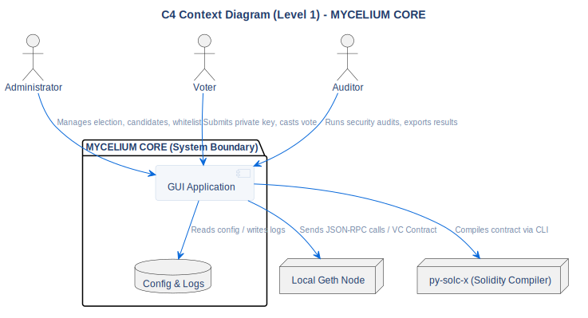

# C4 Context Diagram

## Description
This C4 Level 1 (System Context) diagram illustrates the boundaries of the **MYCELIUM CORE** system, its primary actors, and its interactions with external processes.

## Diagram

## Architectural Intent
**Why we designed it this way:**

- **Encapsulated Complexity:** The Administrator, Voter, and Auditor interact only with the `GUI Application`. All underlying complexities (Solidity compilation, RPC JSON requests, block mining) are completely abstracted away from the end-user.
- **Process Isolation:** The local `Geth Node` and `Solc Compiler` are modeled as external nodes rather than internal components. This reflects the reality that they are independent OS processes managed via subprocessing, ensuring that a node crash does not bring down the PyQt6 application.
- **Zero External Dependencies:** The system has no outbound internet connections during operation (except for the initial compiler download). Everything needed for the voting process is completely self-contained within this context.

## References

- **Source:** `src/diagrams/sources/uml/architecture/c4-context.puml`