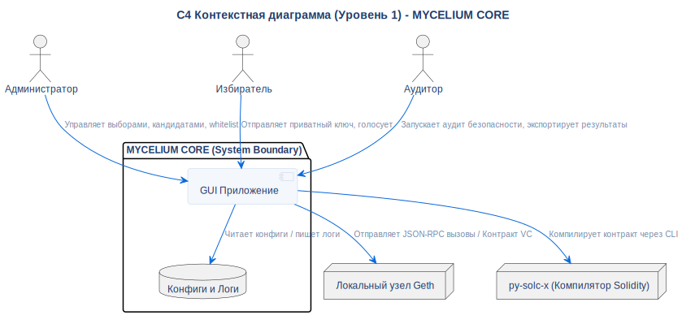

# C4 Контекстная диаграмма

## Описание
Эта диаграмма C4 Уровня 1 (Контекст системы) иллюстрирует границы системы **MYCELIUM CORE**, её основных актёров и взаимодействие с внешними процессами.

## Диаграмма

## Архитектурное обоснование
**Почему спроектировано именно так:**

- **Инкапсуляция сложности:** Администратор, Избиратель и Аудитор взаимодействуют только с `GUI Application`. Вся низкоуровневая сложность (компиляция Solidity, JSON-RPC запросы, майнинг блоков) полностью скрыта от конечного пользователя.
- **Изоляция процессов:** Локальный `Geth Node` и `Solc Compiler` смоделированы как внешние узлы, а не внутренние компоненты. Это отражает тот факт, что они являются независимыми процессами ОС, управляемыми через подпроцессы. Краш узла не приводит к падению приложения PyQt6.
- **Отсутствие внешних зависимостей:** Во время работы система не требует подключения к интернету (за исключением первичной загрузки компилятора). Всё необходимое для процесса голосования полностью самодостаточно в рамках данного контекста.

## Ссылки

- **Источник:** `src/diagrams/sources/uml/architecture/c4-context.puml`