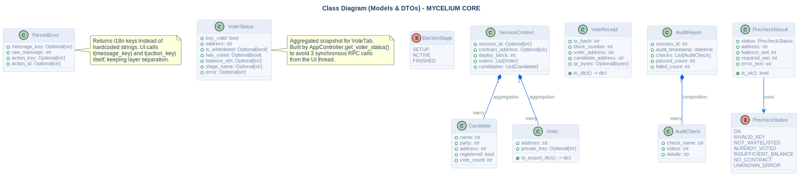

# Class Diagram

## Description
This diagram represents the structural domain models and Data Transfer Objects (DTO) used across the system layers.

## Diagram

## Architectural Intent
**Why we designed it this way:**

- **Thread-Safe Immutable DTOs:** Classes like `PrecheckResult`, `VoterStatus`, and `ParsedError` are designed as frozen dataclasses (`@dataclass(frozen=True)`). This guarantees thread safety when data is passed from background PyQt6 worker threads to the main GUI thread.
- **Anemic Domain Model:** The models intentionally contain minimal logic. They act as pure data containers, while the heavy lifting (validation, blockchain interaction) is delegated to dedicated services like `AuditService` and `VotingService`.
- **Enum-Driven State:** The `ElectionStage` and `PrecheckStatus` enums eliminate "magic strings" and provide compile-time safety for critical state transitions across the application.

## References

- **Code:** `src/core/models.py`, `src/core/precheck.py`, `src/core/error_parser.py`, `src/core/voter_status.py`
- **Source:** `src/diagrams/sources/uml/architecture/class.puml`