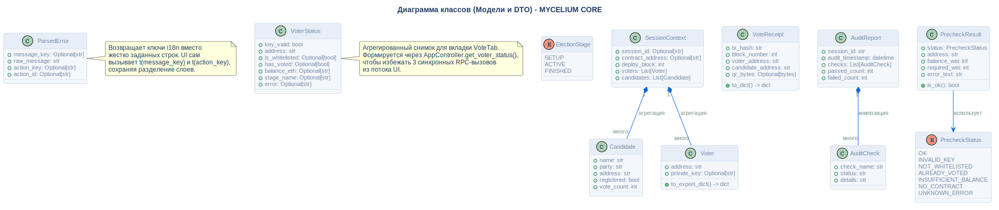

# Диаграмма классов

## Описание
Эта диаграмма представляет структурные доменные модели и объекты передачи данных (DTO), используемые на разных слоях системы.

## Диаграмма

## Архитектурное обоснование
**Почему спроектировано именно так:**

- **Потокобезопасные неизменяемые DTO:** Классы, такие как `PrecheckResult`, `VoterStatus` и `ParsedError`, спроектированы как замороженные датаклассы (`@dataclass(frozen=True)`). Это гарантирует потокобезопасность при передаче данных из фоновых рабочих потоков PyQt6 в основной поток GUI.
- **Анемичная модель предметной области:** Модели намеренно содержат минимум логики. Они действуют как чистые контейнеры данных, тогда как вся тяжелая работа (валидация, взаимодействие с блокчейном) делегирована специализированным сервисам, таким как `AuditService` и `VotingService`.
- **Состояния на базе Enum:** Перечисления `ElectionStage` и `PrecheckStatus` избавляют от "магических строк" и обеспечивают безопасность на уровне типов при критических переходах состояний в приложении.

## Ссылки

- **Код:** `src/core/models.py`, `src/core/precheck.py`, `src/core/error_parser.py`, `src/core/voter_status.py`
- **Источник:** `src/diagrams/sources/uml/architecture/class.puml`