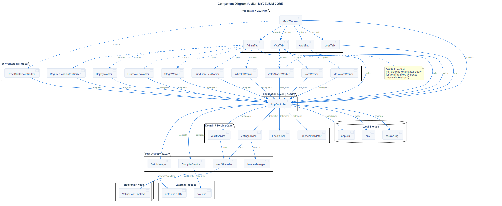

# Component Diagram

## Description
This diagram details the internal physical structure of the **MYCELIUM CORE** codebase, highlighting its strict layered architecture, internal component communication, and external dependencies.

## Diagram

## Architectural Intent
**Why we designed it this way:**

- **Strict Decoupling (Clean Architecture):** The Presentation Layer (UI) has no direct dependencies on the Smart Contract or the Web3 infrastructure. If the Ethereum network is later swapped for another blockchain, the UI will require zero modifications.
- **Facade Pattern:** The `AppController` acts as a single gatekeeper between the UI and the domain logic. This significantly simplifies PyQt6 slot management and eliminates circular dependency risks.
- **Asynchronous Non-Blocking UI:** Every long-running blockchain operation (deployment, funding, mass voting, audit) is strictly relegated to a dedicated `QThread` via a `BaseWorker` subclass. The UI thread never blocks waiting for an RPC response, ensuring a perfectly smooth user experience.
- **State Segregation:** Business logic is stateless where possible, relying on `SessionContext` for active state and `Local Storage` for persistence, making the application robust and predictable.

## References

- **Code:** `src/core/app_controller.py`, `src/ui/main_window.py`
- **ADR:** [ADR-006 (Layered Architecture)](../../architecture/decisions/adr-006-layered-architecture.md)
- **Source:** `src/diagrams/sources/uml/architecture/component.puml`