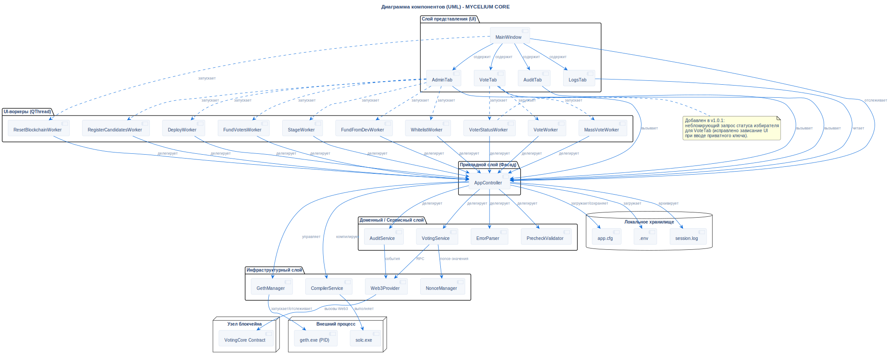

# Диаграмма компонентов

## Описание
Эта диаграмма детализирует внутреннюю физическую структуру кодовой базы **MYCELIUM CORE**, подчеркивая слоистую архитектуру, связи между компонентами и внешние зависимости.

## Диаграмма

## Архитектурное обоснование
**Почему спроектировано именно так:**

- **Строгая развязка (Clean Architecture):** Слой представления (UI) не имеет прямых зависимостей от смарт-контрактов или Web3-инфраструктуры. Если в будущем сеть Ethereum будет заменена на другой блокчейн, UI не потребует никаких изменений.
- **Паттерн Facade:** `AppController` выступает в роли единой точки входа (шлюза) между UI и доменной логикой, что значительно упрощает управление слотами PyQt6 и устраняет риск циклических зависимостей.
- **Асинхронный неблокирующий UI:** Каждая длительная блокчейн-операция (деплой, переводы, массовое голосование, аудит) строго вынесена в выделенный `QThread` через подкласс `BaseWorker`. UI-поток никогда не блокируется в ожидании RPC-ответа, обеспечивая идеальную плавность интерфейса.
- **Разделение состояния:** Бизнес-логика максимально stateless. Для хранения активного состояния используется `SessionContext`, а для долговременного — `Local Storage`, что делает приложение надежным и предсказуемым.

## Ссылки

- **Код:** `src/core/app_controller.py`, `src/ui/main_window.py`
- **ADR:** [ADR-006 (Слоистая архитектура)](../../architecture/decisions/adr-006-layered-architecture.ru.md)
- **Источник:** `src/diagrams/sources/uml/architecture/component.puml`