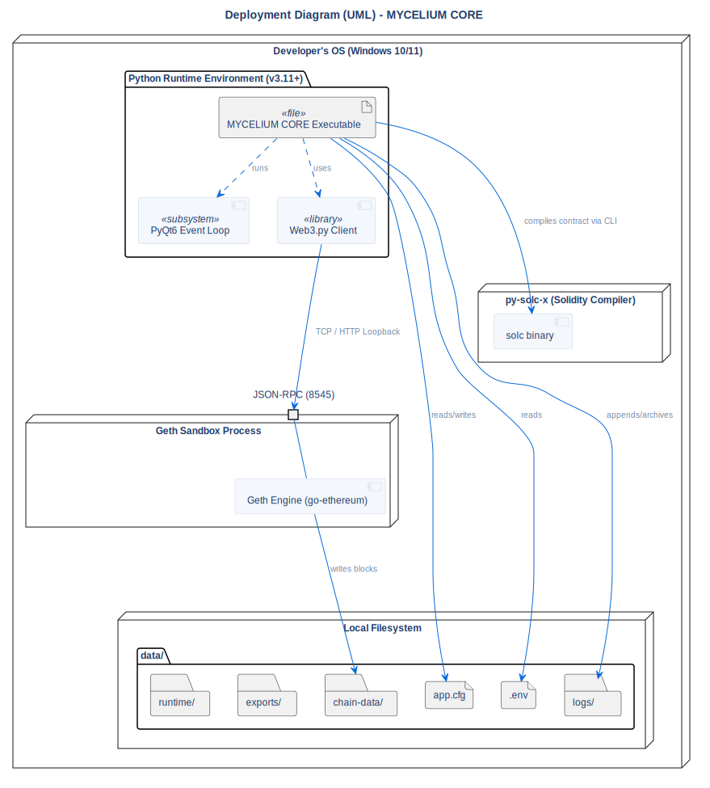

# Deployment Diagram

## Description
This diagram illustrates the physical deployment topology of the application, including internal process execution, local filesystem structures, and network loopbacks.

## Diagram

## Architectural Intent
**Why we designed it this way:**

- **Portable Sandbox (Zero-Install):** The entire system, including runtime folders (`logs/`, `chain-data/`), is localized within the project root directory. It does not write to system-wide AppData or Registry. This ensures immediate teardown and maximum portability.
- **Bundled Executable Concept:** The Python environment and all UI dependencies can be compiled into a single EXE artifact, while the `Geth` and `Solc` binaries are placed alongside in the `bin/` folder, which avoids bloating the file size by embedding large binaries into PyInstaller.
- **Loopback Isolation:** Communication between the Python application and the Ethereum node relies exclusively on local loopback (TCP/HTTP over 127.0.0.1). No ports are exposed to the external network, securing the environment.

## References

- **Code:** `src/utils/paths.py`, `src/core/geth_manager.py`
- **Source:** `src/diagrams/sources/uml/architecture/deployment.puml`