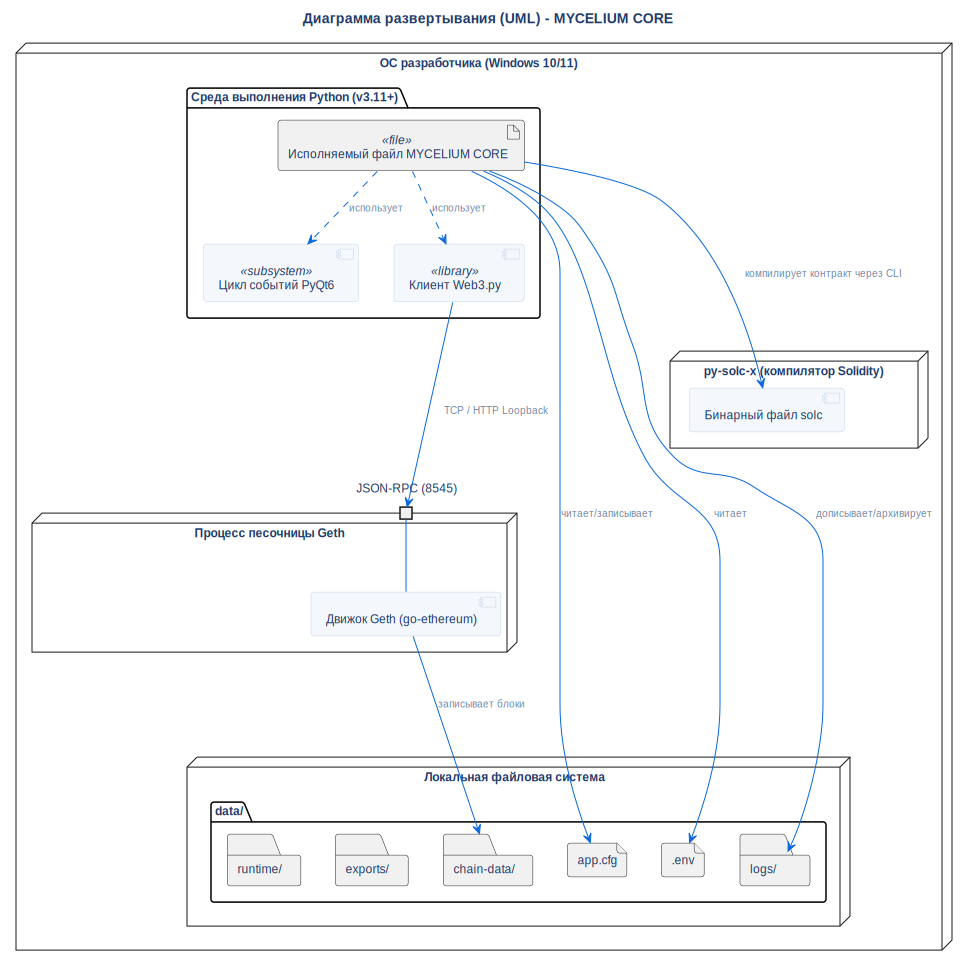

# Диаграмма развёртывания

## Описание
Эта диаграмма иллюстрирует физическую топологию развёртывания приложения, включая выполнение внутренних процессов, структуру локальной файловой системы и сетевые петлевые интерфейсы (loopbacks).

## Диаграмма

## Архитектурное обоснование
**Почему спроектировано именно так:**

- **Портативная песочница (Zero-Install):** Вся система, включая папки времени выполнения (`logs/`, `chain-data/`), локализована в корневом каталоге проекта. Она не пишет данные в системные папки (AppData) или Реестр, что обеспечивает мгновенное удаление и максимальную портативность.
- **Концепция Bundled Executable:** Python-окружение и все UI-зависимости можно скомпилировать в единый EXE-артефакт, тогда как бинарные файлы `Geth` и `Solc` лежат рядом в папке `bin/`, что позволяет не "раздуванить" размера файла при упаковке крупных бинарников внутрь PyInstaller.
- **Изоляция Loopback:** Связь между Python-приложением и узлом Ethereum осуществляется исключительно через локальную петлю (TCP/HTTP через 127.0.0.1). Никакие порты не открываются во внешнюю сеть, что гарантирует безопасность среды.

## Ссылки

- **Код:** `src/utils/paths.py`, `src/core/geth_manager.py`
- **Источник:** `src/diagrams/sources/uml/architecture/deployment.puml`