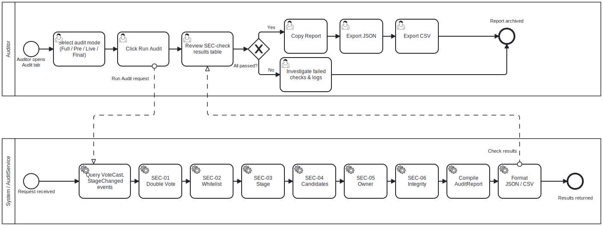

# Auditor Workflow BPMN

## Purpose

This BPMN process describes how an Auditor or researcher verifies a voting
session after or during execution.

The goal is to convert blockchain events and contract state into a structured
audit report.

---

## Context

The process is executed through the Audit tab.

It covers:

- audit mode selection;
- stage availability check;
- event retrieval;
- security checks;
- result review;
- report export.

---

## Diagram

---

## Participants and Lanes

| Participant | Responsibility |
|---|---|
| Auditor / Researcher | Selects audit mode and reviews results |
| MYCELIUM CORE UI | Displays mode availability, checks and reports |
| AuditService | Loads events, executes checks and builds report |
| VotingCore / Geth | Provides contract state and event logs |
| Local Filesystem | Stores exported JSON/CSV reports |

---

## Start Event
The process starts when the Auditor opens the Audit tab.

## Mode Availability by Stage
| Mode | Available Stage |
|---|---|
| Pre-vote | SETUP |
| Live | ACTIVE |
| Final / Full | FINISHED |

The UI automatically disables unavailable modes and shows the "(unavailable)" suffix in the combo box.

---

## Main Flow

1. Auditor selects audit mode.
2. UI checks whether selected mode is available for the current contract stage.
3. If unavailable, UI disables audit execution and shows the reason.
4. If available, the audit worker starts.
5. `AuditService` loads required contract data.
6. For event-based checks, `AuditService` loads events from `deploy_block`.
7. Security checks are executed.
8. `AuditReport` is built.
9. UI displays check statuses and details.
10. UI refreshes candidate results.
11. Auditor reviews warnings or failed checks.
12. Auditor exports report if needed.

---

## Audit Checks

| Check | Meaning |
|---|---|
| SEC-01 Double Vote Protection | Detect duplicate voter addresses |
| SEC-02 Whitelist Enforcement | Verify all voters are whitelisted |
| SEC-03 Stage Enforcement | Verify votes occurred in valid stage range |
| SEC-04 Candidate Validation | Verify vote targets are registered candidates |
| SEC-05 Owner-only Administration | Verify admin actions were sent by owner |
| SEC-06 Vote Count Integrity | Verify len(VoteCast events) == sum(candidate.vote_count) |

---

## Decision Points

### Mode available for stage?

Audit modes are stage-aware.

Examples:

- Pre-vote is available in `SETUP`;
- Live is available in `ACTIVE`;
- Final and Full are available in `FINISHED`.

---

### Any failed checks?

If a check fails, the Auditor should inspect:

- check details;
- transaction sender;
- event logs;
- session log;
- exported report.

---

## End Event

The process ends when the report is reviewed or exported.

Possible outputs:

- visible table of checks;
- copied report;
- JSON report;
- CSV report.

---

## Implementation Mapping

| BPMN Element | Implementation |
|---|---|
| Audit mode selector | `AuditTab` |
| Audit worker | `_StagedAuditWorker` |
| Audit execution | `AuditService.run_*_audit()` |
| Result building | `AuditService.build_results()` |
| Winner detection | `AuditService.detect_winner()` |
| Full report | `AppController.build_full_report()` |
| JSON export | `AppController.export_results()` |
| CSV export | `AppController.export_results_csv()` |

---

## Related Requirements

- FR-AUD-01 — Run full audit
- FR-AUD-02 — Check double voting
- FR-AUD-03 — Check whitelist
- FR-AUD-04 — Check stage
- FR-AUD-05 — Check candidate validity
- FR-AUD-06 — Check administrative restrictions
- FR-AUD-07 — Visual audit representation
- FR-AUD-08 — Export audit report
- NFR-OBS-01..03 — Logging and observability

---

## Analyst Note

The audit process reconstructs trust through event analysis rather than relying
only on UI state.

This is important because the smart contract and event log are the source of
truth for the research sandbox.

---

## Known Limitations

- Audit does not provide vote secrecy.
- Audit assumes local Geth event data is available.
- If the private key was compromised before voting, the contract cannot
  distinguish legitimate and attacker-submitted votes.

---

## Source

[BPMN source](../sources/bpmn/audit-workflow.bpmn)