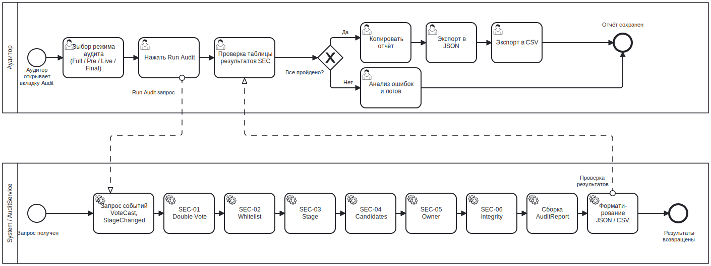

# Рабочий процесс аудитора BPMN

## Назначение

Данный BPMN-процесс описывает, как аудитор или исследователь верифицирует сессию голосования после её завершения или в ходе выполнения.

Цель — преобразовать события блокчейна и состояние контракта в структурированный отчёт аудита.

---

## Контекст

Процесс выполняется через вкладку «Аудит».

Охватывает:

- выбор режима аудита;
- проверку доступности этапа;
- получение событий;
- проверки безопасности;
- просмотр результатов;
- экспорт отчёта.

---

## Диаграмма

---

## Участники и дорожки

| Участник | Ответственность |
|---|---|
| Аудитор / Исследователь | Выбирает режим аудита и изучает результаты |
| MYCELIUM CORE UI | Отображает доступность режимов, проверки и отчёты |
| AuditService | Загружает события, выполняет проверки и формирует отчёт |
| VotingCore / Geth | Предоставляет состояние контракта и журналы событий |
| Локальная файловая система | Хранит экспортированные отчёты в формате JSON/CSV |

---

## Начальное событие
Процесс запускается в момент открытия аудитором вкладки «Аудит».

## Доступность режимов по этапам
| Режим | Доступный этап |
|---|---|
| Предварительный (Pre-vote) | SETUP |
| Активный (Live) | ACTIVE |
| Финальный / Полный (Final / Full) | FINISHED |

Интерфейс автоматически отключает недоступные режимы и отображает суффикс «(недоступно)» в выпадающем списке.

---

## Основной поток

1. Аудитор выбирает режим аудита.
2. Интерфейс проверяет, доступен ли выбранный режим для текущего этапа контракта.
3. Если режим недоступен — интерфейс блокирует запуск аудита и отображает причину.
4. Если режим доступен — запускается рабочий процесс аудита.
5. `AuditService` загружает необходимые данные контракта.
6. Для проверок на основе событий `AuditService` загружает события начиная с блока `deploy_block`.
7. Выполняются проверки безопасности.
8. Формируется `AuditReport`.
9. Интерфейс отображает статусы и детали проверок.
10. Интерфейс обновляет результаты по кандидатам.
11. Аудитор изучает предупреждения или проваленные проверки.
12. При необходимости аудитор экспортирует отчёт.

---

## Проверки аудита

| Проверка | Смысл |
|---|---|
| SEC-01 Защита от двойного голосования | Обнаружение дублирующихся адресов голосующих |
| SEC-02 Соблюдение белого списка | Верификация принадлежности всех голосующих к белому списку |
| SEC-03 Соблюдение этапности | Проверка того, что голоса поданы в допустимом диапазоне этапов |
| SEC-04 Валидация кандидатов | Проверка того, что цели голосования являются зарегистрированными кандидатами |
| SEC-05 Администрирование только владельцем | Проверка того, что административные действия выполнены владельцем |
| SEC-06 Целостность подсчёта голосов | Проверка соответствия: len(события VoteCast) == sum(candidate.vote_count) |

---

## Точки принятия решений

### Режим доступен для данного этапа?

Режимы аудита зависят от этапа.

Примеры:

- предварительный режим доступен на этапе `SETUP`;
- активный режим доступен на этапе `ACTIVE`;
- финальный и полный режимы доступны на этапе `FINISHED`.

---

### Есть ли проваленные проверки?

При провале проверки аудитору следует изучить:

- детали проверки;
- отправителя транзакции;
- журналы событий;
- журнал сессии;
- экспортированный отчёт.

---

## Завершающее событие

Процесс завершается после просмотра или экспорта отчёта.

Возможные результаты:

- таблица проверок на экране;
- скопированный отчёт;
- отчёт в формате JSON;
- отчёт в формате CSV.

---

## Сопоставление с реализацией

| Элемент BPMN | Реализация |
|---|---|
| Селектор режима аудита | `AuditTab` |
| Рабочий процесс аудита | `_StagedAuditWorker` |
| Выполнение аудита | `AuditService.run_*_audit()` |
| Формирование результатов | `AuditService.build_results()` |
| Определение победителя | `AuditService.detect_winner()` |
| Полный отчёт | `AppController.build_full_report()` |
| Экспорт в JSON | `AppController.export_results()` |
| Экспорт в CSV | `AppController.export_results_csv()` |

---

## Связанные требования

- FR-AUD-01 — Запуск полного аудита
- FR-AUD-02 — Проверка двойного голосования
- FR-AUD-03 — Проверка белого списка
- FR-AUD-04 — Проверка этапности
- FR-AUD-05 — Проверка валидности кандидатов
- FR-AUD-06 — Проверка административных ограничений
- FR-AUD-07 — Визуальное представление аудита
- FR-AUD-08 — Экспорт отчёта аудита
- NFR-OBS-01..03 — Журналирование и наблюдаемость

---

## Примечание аналитика

Процесс аудита восстанавливает доверие через анализ событий, а не опираясь исключительно на состояние интерфейса.

Это принципиально важно, поскольку смарт-контракт и журнал событий являются источником истины для исследовательской песочницы.

---

## Известные ограничения

- Аудит не обеспечивает тайну голосования.
- Аудит предполагает наличие локально доступных данных о событиях Geth.
- В случае компрометации закрытого ключа до начала голосования контракт не способен отличить легитимные голоса от поданных злоумышленником.

---

## Источник

[Источник BPMN](../sources/bpmn/audit-workflow.ru.bpmn)