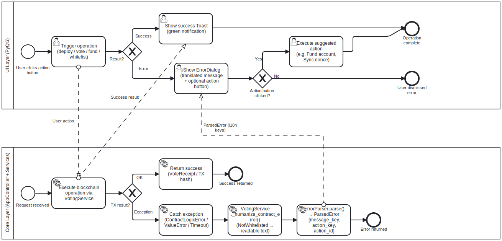

# Error Handling BPMN

## Purpose

This BPMN process describes how MYCELIUM CORE handles user-visible runtime
errors during blockchain operations.

The goal is to prevent crashes, classify common failures and provide clear
feedback or next actions to the user.

---

## Context

Errors may occur during:

- contract deployment;
- funding;
- candidate registration;
- whitelist registration;
- vote submission;
- audit;
- reset workflow.

The process focuses on user-facing errors, not internal exception stack traces.

---

## Diagram

---

## Participants and Lanes

| Participant | Responsibility |
|---|---|
| User | Initiates action and receives feedback |
| UI Worker | Executes long operation and catches exceptions |
| AppController | Delegates to services and parses errors |
| ErrorParser | Classifies known RPC and contract errors |
| Message Dialog | Displays human-readable message and optional action |
| Logs | Store diagnostic details with secret redaction |

---

## Start Event

The process starts when a runtime operation fails.

Examples:

- insufficient funds;
- nonce conflict;
- contract revert;
- RPC timeout;
- invalid stage;
- unauthorized action.

---

## Main Flow

1. User starts an operation.
2. UI launches a background worker.
3. Worker calls `AppController`.
4. A service raises an exception or returns an error.
5. Worker catches the exception.
6. Worker emits an error signal.
7. UI asks `AppController.parse_rpc_error()` to classify the error.
8. `ErrorParser` checks known patterns.
9. UI displays an error dialog.
10. If available, UI shows a suggested action.
11. Error is logged with secret redaction.

---

## Error Categories

| Category | Example | User Action |
|---|---|---|
| Insufficient funds | Account has no ETH for gas | Fund account |
| Nonce conflict | Nonce too low / already known | Retry after sync |
| Contract revert | `NotWhitelisted`, `AlreadyVoted` | Fix precondition |
| Timeout | Receipt was not received in time | Check status / retry |
| RPC unavailable | Geth not responding | Check node and logs |
| Invalid input | Bad key or address | Correct input |

---

## Decision Points

### Is error recognized?

If yes, a human-readable explanation is shown.

If no, the raw error is shown in a generic blockchain failure dialog.

---

### Is there a suggested action?

Some errors provide next action guidance, for example:

- fund account;
- retry after nonce synchronization;
- check transaction status.

---

## End Event

The process ends when the user receives an actionable error message and the UI
returns to a safe state.

---

## Implementation Mapping

| BPMN Element | Implementation |
|---|---|
| Worker error capture | `BaseWorker.error` signal |
| Error parsing | `ErrorParser.parse()` |
| Controller facade | `AppController.parse_rpc_error()` |
| Error dialog | `ErrorDialog`, `MessageDialog` |
| Logging | `src/utils/logger.py` |
| Secret filtering | `_SecretFilter` |

---

## Related Requirements

- FR-ENV-05 — Environment error handling
- NFR-REL-01 — RPC error resilience
- NFR-REL-02 — Input error resilience
- NFR-SEC-02 — Do not log secrets
- NFR-SEC-05 — Safe default behavior
- NFR-OBS-03 — Error logging

---

## Analyst Note

The process separates exception handling from error presentation.

Workers catch errors, the controller parses them, and UI dialogs present the
result. This prevents blockchain-specific logic from leaking directly into UI
widgets.

---

## Known Limitations

- Unknown low-level RPC errors may still be shown as generic messages.
- The system cannot automatically fix all contract reverts.
- Some timeout transactions may still be pending in the local node.

---

## Source

[BPMN source](../sources/bpmn/error-handling.bpmn)