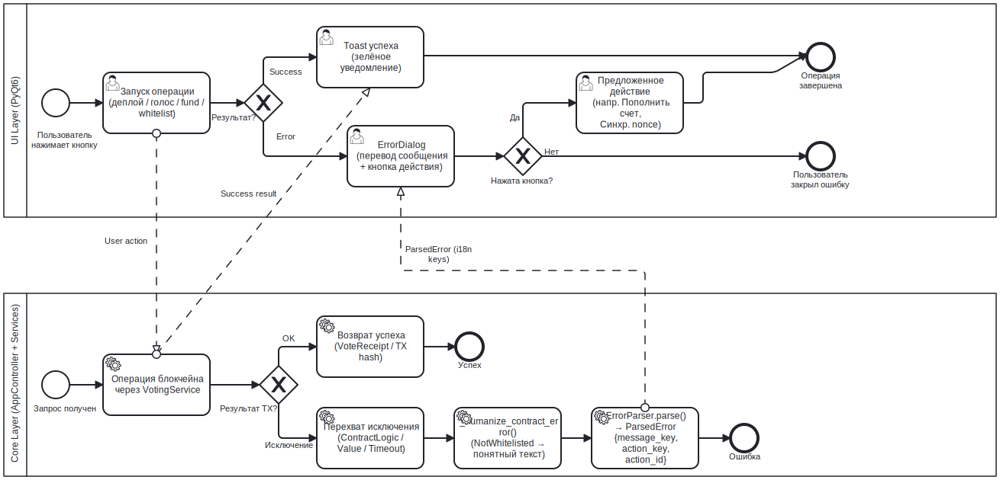

# Обработка ошибок BPMN

## Назначение

Данный BPMN-процесс описывает, как MYCELIUM CORE обрабатывает видимые пользователю ошибки времени выполнения в ходе блокчейн-операций.

Цель — предотвратить аварийные сбои, классифицировать типичные отказы и предоставить пользователю понятную обратную связь или рекомендации по дальнейшим действиям.

---

## Контекст

Ошибки могут возникать в ходе:

- развёртывания контракта;
- пополнения баланса;
- регистрации кандидатов;
- регистрации белого списка;
- подачи голоса;
- аудита;
- сброса рабочего процесса.

Процесс сосредоточен на ошибках, видимых пользователю, а не на внутренних трассировках стека исключений.

---

## Диаграмма

---

## Участники и дорожки

| Участник | Ответственность |
|---|---|
| Пользователь | Инициирует действие и получает обратную связь |
| UI Worker | Выполняет длительную операцию и перехватывает исключения |
| AppController | Делегирует вызовы сервисам и разбирает ошибки |
| ErrorParser | Классифицирует известные ошибки RPC и контракта |
| Диалог сообщения | Отображает читаемое сообщение и необязательное действие |
| Журналы | Хранят диагностические данные с редакцией секретов |

---

## Начальное событие

Процесс запускается в момент сбоя операции времени выполнения.

Примеры:

- недостаточно средств;
- конфликт nonce;
- откат контракта;
- тайм-аут RPC;
- недопустимый этап;
- несанкционированное действие.

---

## Основной поток

1. Пользователь запускает операцию.
2. Интерфейс запускает фоновый рабочий процесс.
3. Рабочий процесс вызывает `AppController`.
4. Сервис выбрасывает исключение или возвращает ошибку.
5. Рабочий процесс перехватывает исключение.
6. Рабочий процесс испускает сигнал об ошибке.
7. Интерфейс обращается к `AppController.parse_rpc_error()` для классификации ошибки.
8. `ErrorParser` проверяет известные шаблоны.
9. Интерфейс отображает диалог с сообщением об ошибке.
10. При наличии — интерфейс показывает рекомендуемое действие.
11. Ошибка записывается в журнал с редакцией секретов.

---

## Категории ошибок

| Категория | Пример | Действие пользователя |
|---|---|---|
| Недостаточно средств | На счёте нет ETH для оплаты газа | Пополнить счёт |
| Конфликт nonce | Nonce слишком мал / уже известен | Повторить попытку после синхронизации |
| Откат контракта | `NotWhitelisted`, `AlreadyVoted` | Устранить нарушение предусловия |
| Тайм-аут | Квитанция не получена в отведённое время | Проверить статус / повторить попытку |
| RPC недоступен | Geth не отвечает | Проверить узел и журналы |
| Некорректный ввод | Неверный ключ или адрес | Исправить ввод |

---

## Точки принятия решений

### Ошибка распознана?

Если да — отображается понятное пользователю объяснение.

Если нет — исходный текст ошибки отображается в универсальном диалоге сбоя блокчейн-операции.

---

### Есть ли рекомендуемое действие?

Некоторые ошибки сопровождаются подсказками о следующем шаге, например:

- пополнить счёт;
- повторить попытку после синхронизации nonce;
- проверить статус транзакции.

---

## Завершающее событие

Процесс завершается, когда пользователь получает actionable-сообщение об ошибке и интерфейс возвращается в безопасное состояние.

---

## Сопоставление с реализацией

| Элемент BPMN | Реализация |
|---|---|
| Перехват ошибки рабочим процессом | Сигнал `BaseWorker.error` |
| Разбор ошибки | `ErrorParser.parse()` |
| Фасад контроллера | `AppController.parse_rpc_error()` |
| Диалог ошибки | `ErrorDialog`, `MessageDialog` |
| Журналирование | `src/utils/logger.py` |
| Фильтрация секретов | `_SecretFilter` |

---

## Связанные требования

- FR-ENV-05 — Обработка ошибок среды
- NFR-REL-01 — Устойчивость к ошибкам RPC
- NFR-REL-02 — Устойчивость к ошибкам ввода
- NFR-SEC-02 — Запрет записи секретов в журнал
- NFR-SEC-05 — Безопасное поведение по умолчанию
- NFR-OBS-03 — Журналирование ошибок

---

## Примечание аналитика

Процесс разделяет обработку исключений и представление ошибок.

Рабочие процессы перехватывают ошибки, контроллер их разбирает, а диалоги интерфейса представляют результат пользователю. Это предотвращает прямое проникновение блокчейн-специфичной логики в виджеты интерфейса.

---

## Известные ограничения

- Неизвестные низкоуровневые ошибки RPC могут по-прежнему отображаться в виде универсальных сообщений.
- Система не способна автоматически устранить все откаты контракта.
- Некоторые транзакции с тайм-аутом могут оставаться в состоянии ожидания на локальном узле.

---

## Источник

[Источник BPMN](../sources/bpmn/error-handling.ru.bpmn)