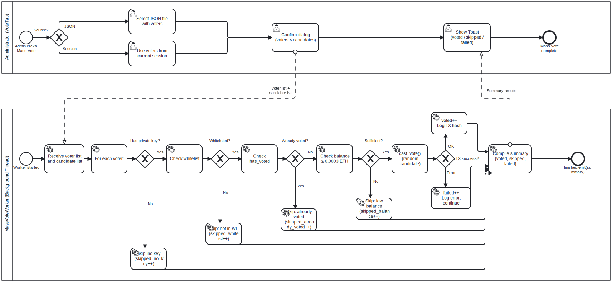

# Mass Vote Pipeline BPMN

## Purpose

This BPMN process describes the automated mass-vote testing workflow.

The goal is to simulate multiple voters casting votes in a local sandbox while
skipping invalid or ineligible voters without stopping the entire run.

---

## Context

Mass Vote is a testing feature available from the Vote tab.

It is used for:

- load testing the local Geth node;
- verifying whitelist and balance preconditions;
- generating enough events for audit demonstrations;
- validating batch transaction behavior in a controlled environment.

Mass Vote is not intended for real election usage.

---

## Diagram



---

## Participants and Lanes

| Participant | Responsibility |
|---|---|
| Tester / Administrator | Selects voter source and starts mass vote |
| MYCELIUM CORE UI | Confirms action and displays progress |
| MassVoteWorker | Iterates voters, filters invalid entries and submits votes |
| AppController / VotingService | Performs checks and sends vote transactions |
| VotingCore / Geth | Executes and confirms transactions |

---

## Start Event

The process starts when the user selects:

- **From Session**; or
- **From JSON File**.

---

## Main Flow

1. User chooses the voter source.
2. UI verifies that voting is currently available.
3. UI loads candidate addresses from the contract.
4. UI asks for confirmation because votes are irreversible.
5. `MassVoteWorker` starts.
6. Worker iterates over the voter list.
7. For each voter, worker checks:
   - private key exists;
   - voter is whitelisted;
   - voter has not voted;
   - voter has enough ETH for gas.
8. If voter is eligible, worker randomly selects a candidate.
9. Worker calls `AppController.cast_vote()`.
10. Vote transaction is submitted and confirmed.
11. Worker records success, skip or failure.
12. UI displays summary.

---

## Skip Reasons

A voter can be skipped for the following reasons:

| Reason | Meaning |
|---|---|
| No private key | Cannot sign transaction |
| Not whitelisted | Contract would reject vote |
| Already voted | Double vote prevention |
| Insufficient balance | Cannot pay gas |
| Invalid record | JSON or session data incomplete |

---

## Failure Handling

A transaction failure for one voter does not abort the full mass-vote process.

The worker:

- records the failure;
- emits progress text;
- continues with the next voter.

---

## End Event

The process ends with a summary:

```text
voted / skipped / failed / total
```

The Audit tab can then be used to inspect generated events.

---

## Implementation Mapping

| BPMN Element | Implementation |
|---|---|
| Source selection | `VoteTab._mass_vote_from_json()`, `VoteTab._mass_vote_from_session()` |
| Confirmation | `question_yn()` dialog |
| Worker loop | `MassVoteWorker.run()` |
| Whitelist check | `AppController.is_whitelisted()` |
| Already voted check | `AppController.has_voted()` |
| Balance check | `AppController.get_balance_wei()` |
| Vote submission | `AppController.cast_vote()` |
| Result summary | `MassVoteWorker.finished` payload |

---

## Related Requirements

- FR-VOTE-05 — Show candidates
- FR-VOTE-07 — Submit vote
- FR-AUD-02 — Double vote verification
- FR-AUD-03 — Whitelist verification
- NFR-PERF-01 — Non-blocking UI
- NFR-PERF-02 — Background workers

---

## Analyst Note

Mass Vote is modelled as a controlled testing pipeline rather than a normal
voter business process.

This distinction matters because the feature is used to generate test data and
stress local infrastructure, not to represent real user voting behavior.

---

## Known Limitations

- Votes are assigned randomly.
- The process is not anonymous.
- It is intended only for local testing.
- It depends on exported or generated private keys.

---

## Source

[BPMN source](../sources/bpmn/mass-vote-pipeline.bpmn)