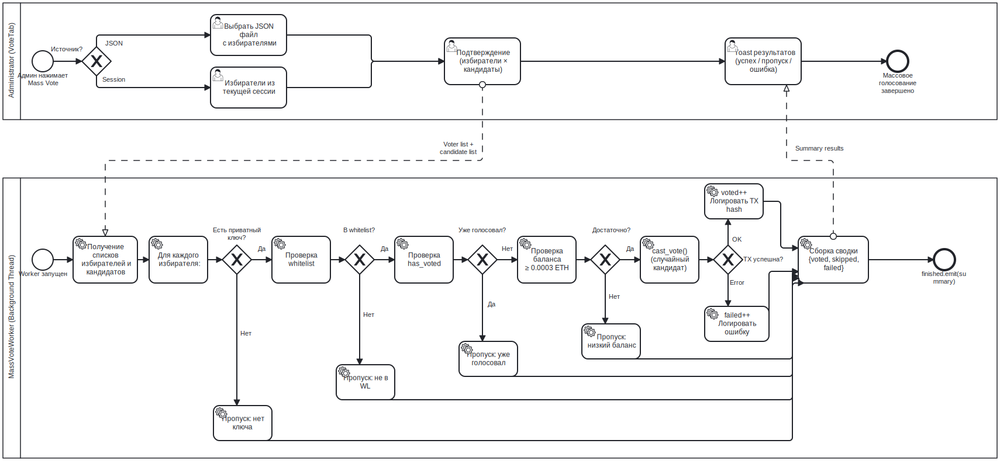

# Конвейер массового голосования BPMN

## Назначение

Данный BPMN-процесс описывает автоматизированный рабочий процесс тестирования массового голосования.

Цель — смоделировать подачу голосов несколькими голосующими в локальной песочнице с пропуском недопустимых или неправомочных участников без остановки всего прогона.

---

## Контекст

Массовое голосование — тестовая функция, доступная во вкладке «Голосование».

Используется для:

- нагрузочного тестирования локального узла Geth;
- проверки предусловий белого списка и баланса;
- генерации достаточного количества событий для демонстрации аудита;
- валидации поведения пакетных транзакций в контролируемой среде.

Массовое голосование не предназначено для реального применения на выборах.

---

## Диаграмма



---

## Участники и дорожки

| Участник | Ответственность |
|---|---|
| Тестировщик / Администратор | Выбирает источник голосующих и запускает массовое голосование |
| MYCELIUM CORE UI | Подтверждает действие и отображает ход выполнения |
| MassVoteWorker | Перебирает голосующих, фильтрует недопустимые записи и отправляет голоса |
| AppController / VotingService | Выполняет проверки и отправляет транзакции голосования |
| VotingCore / Geth | Исполняет и подтверждает транзакции |

---

## Начальное событие

Процесс запускается, когда пользователь выбирает:

- **из сессии**; или
- **из файла JSON**.

---

## Основной поток

1. Пользователь выбирает источник голосующих.
2. Интерфейс проверяет, доступно ли голосование в данный момент.
3. Интерфейс загружает адреса кандидатов из контракта.
4. Интерфейс запрашивает подтверждение, поскольку голоса необратимы.
5. Запускается `MassVoteWorker`.
6. Рабочий процесс перебирает список голосующих.
7. Для каждого голосующего рабочий процесс проверяет:
   - наличие закрытого ключа;
   - включение голосующего в белый список;
   - отсутствие ранее поданного голоса;
   - наличие достаточного количества ETH для оплаты газа.
8. Если голосующий правомочен — рабочий процесс случайным образом выбирает кандидата.
9. Рабочий процесс вызывает `AppController.cast_vote()`.
10. Транзакция голосования отправляется и подтверждается.
11. Рабочий процесс фиксирует успех, пропуск или сбой.
12. Интерфейс отображает сводку.

---

## Причины пропуска

Голосующий может быть пропущен по следующим причинам:

| Причина | Значение |
|---|---|
| Нет закрытого ключа | Невозможно подписать транзакцию |
| Не в белом списке | Контракт отклонит голос |
| Уже проголосовал | Защита от двойного голосования |
| Недостаточно средств | Невозможно оплатить газ |
| Некорректная запись | Данные JSON или сессии неполны |

---

## Обработка сбоев

Сбой транзакции одного голосующего не прерывает весь процесс массового голосования.

Рабочий процесс:

- фиксирует сбой;
- испускает текст о ходе выполнения;
- переходит к следующему голосующему.

---

## Завершающее событие

Процесс завершается сводкой:

```text
проголосовало / пропущено / сбоев / всего
```

Для проверки сгенерированных событий можно воспользоваться вкладкой «Аудит».

---

## Сопоставление с реализацией

| Элемент BPMN | Реализация |
|---|---|
| Выбор источника | `VoteTab._mass_vote_from_json()`, `VoteTab._mass_vote_from_session()` |
| Подтверждение | Диалог `question_yn()` |
| Цикл рабочего процесса | `MassVoteWorker.run()` |
| Проверка белого списка | `AppController.is_whitelisted()` |
| Проверка повторного голосования | `AppController.has_voted()` |
| Проверка баланса | `AppController.get_balance_wei()` |
| Отправка голоса | `AppController.cast_vote()` |
| Сводка результатов | Полезная нагрузка `MassVoteWorker.finished` |

---

## Связанные требования

- FR-VOTE-05 — Отображение кандидатов
- FR-VOTE-07 — Подача голоса
- FR-AUD-02 — Проверка двойного голосования
- FR-AUD-03 — Проверка белого списка
- NFR-PERF-01 — Неблокирующий интерфейс
- NFR-PERF-02 — Фоновые рабочие процессы

---

## Примечание аналитика

Массовое голосование смоделировано как контролируемый тестовый конвейер, а не как обычный бизнес-процесс голосующего.

Это разграничение принципиально важно, поскольку функция используется для генерации тестовых данных и нагрузочного тестирования локальной инфраструктуры, а не для воспроизведения реального поведения пользователей при голосовании.

---

## Известные ограничения

- Голоса распределяются случайным образом.
- Процесс не является анонимным.
- Предназначен исключительно для локального тестирования.
- Зависит от экспортированных или сгенерированных закрытых ключей.

---

## Источник

[Источник BPMN](../sources/bpmn/mass-vote-pipeline.ru.bpmn)