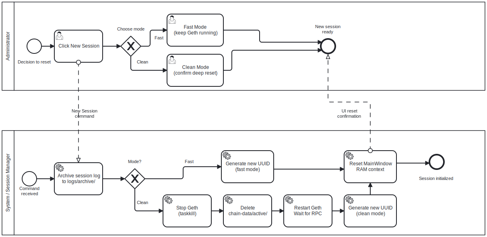

# Session Lifecycle BPMN

## Purpose

This BPMN process describes how MYCELIUM CORE manages voting sessions during
normal use, new session creation and clean blockchain reset.

The goal is to show how the application moves from one voting workflow to the
next while preserving logs and keeping local runtime state consistent.

---

## Context

The process is initiated by the Administrator through the main window header.

It covers:

- new session creation;
- session log archiving;
- UI context reset;
- optional blockchain data reset;
- local Geth restart;
- RPC reconnection.

This process describes the application-level lifecycle, not the smart contract
stage lifecycle. The smart contract lifecycle is documented separately in the
state diagrams.

---

## Diagram



---

## Participants and Lanes

| Participant | Responsibility |
|---|---|
| Administrator | Confirms new session or reset action |
| MYCELIUM CORE UI | Shows confirmation dialogs and resets tabs |
| AppController | Archives logs, resets session context and coordinates services |
| GethManager | Stops and starts the application-owned Geth process |
| Web3Provider | Reconnects to JSON-RPC |
| Local Filesystem | Stores logs, archives and chain data |

---

## Start Event

The process starts when the Administrator chooses one of the session actions:

- **New Session**;
- **Reset Blockchain Data**.

---

## Main Flow: New Session

1. Administrator clicks **New Session**.
2. UI checks whether background workers are active.
3. UI asks for confirmation.
4. `AppController` archives the current session log.
5. `VotingService` state is reset.
6. A new `SessionContext` is created.
7. UI clears tab state:
   - Admin;
   - Vote;
   - Audit;
   - Logs.
8. Footer and status labels return to initial state.
9. Application is ready for a new contract deployment.

---

## Main Flow: Clean Reset

1. Administrator clicks **Reset Data**.
2. UI opens reset confirmation dialog.
3. User confirms deletion of active blockchain data.
4. Reset worker starts in a background thread.
5. `AppController` detaches current Web3 reference.
6. `GethManager` stops the application-owned Geth process.
7. Application waits for Windows file locks to release.
8. Active chain data is deleted with retry.
9. Optional archived logs are deleted if selected.
10. `GethManager` starts a new Geth dev process.
11. `Web3Provider` reconnects to JSON-RPC.
12. A new session is created.
13. UI state is reset.

---

## Decision Points

### Background operations active?

If active workers exist, the user must confirm before closing or resetting.

---

### Delete archived logs?

During clean reset, archived logs are deleted only if the user selected that
option.

---

### File locks released?

If Windows still locks chain-data files, the application retries deletion. If
retry fails, the user receives a manual cleanup instruction.

---

## End Event

The process ends when the application returns to a clean setup-ready state:

```text
No contract deployed
Stage badge reset
Session context empty
Geth RPC connected
```

---

## Implementation Mapping

| BPMN Element | Implementation |
|---|---|
| New Session button | `MainWindow._new_session()` |
| Reset Data button | `MainWindow._reset_blockchain()` |
| Reset confirmation | `ResetChainDialog` |
| Background reset | `ResetBlockchainWorker` |
| Session archive | `archive_session_log()` |
| Session reset | `AppController.new_session()` |
| Blockchain reset | `AppController.reset_blockchain_data()` |
| Geth lifecycle | `GethManager.start()`, `GethManager.stop()` |
| RPC reconnect | `Web3Provider.connect()`, `wait_for_rpc()` |

---

## Related Requirements

- FR-SESSION-01 — Create new session
- FR-SESSION-02 — Confirmation before reset
- FR-SESSION-03 — Archive current session
- FR-SESSION-05 — Clean mode
- FR-SESSION-06 — Reset active UI context
- FR-ENV-06 — Correct node shutdown
- NFR-REL-04 — Safe new session behavior
- NFR-OBS-02 — Session log archiving

---

## Analyst Note

The session lifecycle separates application context reset from blockchain data
reset.

This separation is important because a lightweight new session is faster, while
a clean reset provides a fully fresh local sandbox for repeatable
demonstrations.

---

## Version 1.0.1 Safety Note

MYCELIUM CORE stops only the Geth process it started itself.

It does not terminate external `geth.exe` processes by name.

---

## Known Limitations

- Clean reset deletes active local blockchain data.
- The current sandbox does not preserve contract history across clean reset.
- Manual cleanup may be required if Windows keeps database files locked.

---

## Source

[BPMN source](../sources/bpmn/session-lifecycle.bpmn)