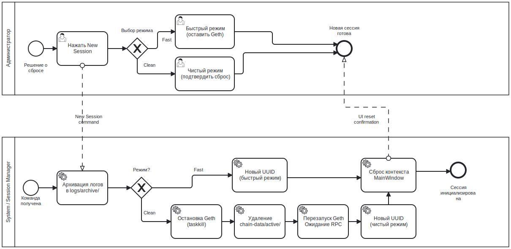

# Жизненный цикл сессии BPMN

## Назначение

Данный BPMN-процесс описывает, как MYCELIUM CORE управляет сессиями голосования в ходе обычного использования, создания новой сессии и чистого сброса блокчейна.

Цель — показать, как приложение переходит от одного рабочего процесса голосования к следующему, сохраняя журналы и поддерживая согласованность локального состояния времени выполнения.

---

## Контекст

Процесс инициируется администратором через заголовок главного окна.

Охватывает:

- создание новой сессии;
- архивирование журнала сессии;
- сброс контекста интерфейса;
- опциональный сброс данных блокчейна;
- перезапуск локального Geth;
- переподключение к RPC.

Данный процесс описывает жизненный цикл на уровне приложения, а не жизненный цикл этапов смарт-контракта. Жизненный цикл смарт-контракта задокументирован отдельно в диаграммах состояний.

---

## Диаграмма



---

## Участники и дорожки

| Участник | Ответственность |
|---|---|
| Администратор | Подтверждает создание новой сессии или действие по сбросу |
| MYCELIUM CORE UI | Отображает диалоги подтверждения и сбрасывает вкладки |
| AppController | Архивирует журналы, сбрасывает контекст сессии и координирует сервисы |
| GethManager | Останавливает и запускает принадлежащий приложению процесс Geth |
| Web3Provider | Переподключается к JSON-RPC |
| Локальная файловая система | Хранит журналы, архивы и данные цепочки |

---

## Начальное событие

Процесс запускается, когда администратор выбирает одно из действий с сессией:

- **Новая сессия**;
- **Сброс данных блокчейна**.

---

## Основной поток: новая сессия

1. Администратор нажимает **Новая сессия**.
2. Интерфейс проверяет, активны ли фоновые рабочие процессы.
3. Интерфейс запрашивает подтверждение.
4. `AppController` архивирует текущий журнал сессии.
5. Состояние `VotingService` сбрасывается.
6. Создаётся новый `SessionContext`.
7. Интерфейс очищает состояние вкладок:
   - Администрирование;
   - Голосование;
   - Аудит;
   - Журналы.
8. Нижняя панель и метки статуса возвращаются в исходное состояние.
9. Приложение готово к развёртыванию нового контракта.

---

## Основной поток: чистый сброс

1. Администратор нажимает **Сбросить данные**.
2. Интерфейс открывает диалог подтверждения сброса.
3. Пользователь подтверждает удаление активных данных блокчейна.
4. Рабочий процесс сброса запускается в фоновом потоке.
5. `AppController` отсоединяет текущую ссылку на Web3.
6. `GethManager` останавливает принадлежащий приложению процесс Geth.
7. Приложение ожидает снятия файловых блокировок Windows.
8. Активные данные цепочки удаляются с повторными попытками.
9. Архивные журналы удаляются, если пользователь выбрал эту опцию.
10. `GethManager` запускает новый процесс Geth в режиме разработки.
11. `Web3Provider` переподключается к JSON-RPC.
12. Создаётся новая сессия.
13. Состояние интерфейса сбрасывается.

---

## Точки принятия решений

### Активны ли фоновые операции?

При наличии активных рабочих процессов пользователь должен подтвердить действие перед закрытием или сбросом.

---

### Удалить архивные журналы?

В ходе чистого сброса архивные журналы удаляются только в том случае, если пользователь выбрал эту опцию.

---

### Файловые блокировки сняты?

Если Windows по-прежнему удерживает файлы данных цепочки заблокированными, приложение повторяет попытку удаления. При неудаче повторной попытки пользователь получает инструкцию по ручной очистке.

---

## Завершающее событие

Процесс завершается, когда приложение возвращается в чистое состояние, готовое к настройке:

```text
Контракт не развёрнут
Индикатор этапа сброшен
Контекст сессии пуст
RPC Geth подключён
```

---

## Сопоставление с реализацией

| Элемент BPMN | Реализация |
|---|---|
| Кнопка «Новая сессия» | `MainWindow._new_session()` |
| Кнопка «Сбросить данные» | `MainWindow._reset_blockchain()` |
| Подтверждение сброса | `ResetChainDialog` |
| Фоновый сброс | `ResetBlockchainWorker` |
| Архивирование сессии | `archive_session_log()` |
| Сброс сессии | `AppController.new_session()` |
| Сброс блокчейна | `AppController.reset_blockchain_data()` |
| Жизненный цикл Geth | `GethManager.start()`, `GethManager.stop()` |
| Переподключение к RPC | `Web3Provider.connect()`, `wait_for_rpc()` |

---

## Связанные требования

- FR-SESSION-01 — Создание новой сессии
- FR-SESSION-02 — Подтверждение перед сбросом
- FR-SESSION-03 — Архивирование текущей сессии
- FR-SESSION-05 — Режим чистого сброса
- FR-SESSION-06 — Сброс активного контекста интерфейса
- FR-ENV-06 — Корректное завершение работы узла
- NFR-REL-04 — Безопасное поведение при создании новой сессии
- NFR-OBS-02 — Архивирование журнала сессии

---

## Примечание аналитика

Жизненный цикл сессии разделяет сброс контекста приложения и сброс данных блокчейна.

Это разграничение принципиально важно: лёгкое создание новой сессии выполняется быстрее, тогда как чистый сброс обеспечивает полностью свежую локальную песочницу для воспроизводимых демонстраций.

---

## Примечание по безопасности версии 1.0.1

MYCELIUM CORE останавливает только тот процесс Geth, который был запущен им самим.

Внешние процессы `geth.exe` по имени не завершаются.

---

## Известные ограничения

- Чистый сброс удаляет активные данные локального блокчейна.
- Текущая песочница не сохраняет историю контрактов между чистыми сбросами.
- В случае удержания файлов базы данных заблокированными со стороны Windows может потребоваться ручная очистка.

---

## Источник

[Источник BPMN](../sources/bpmn/session-lifecycle.ru.bpmn)