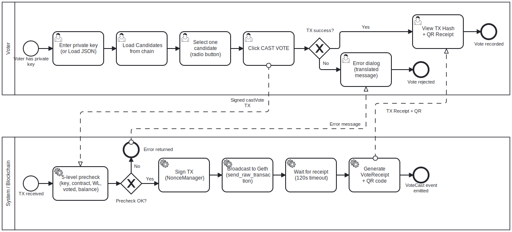

# Voting Cast Phase BPMN

## Purpose

This BPMN process describes how a voter casts a vote after the election has
entered the `ACTIVE` stage.

The goal is to transform a valid voter decision into a confirmed blockchain
transaction and a local QR receipt.

---

## Context

The process is executed through the Vote tab.

It covers:

- voter private key input;
- voter status validation;
- candidate selection;
- pre-vote checks;
- signed transaction submission;
- receipt generation.

---

## Diagram



---

## Participants and Lanes

| Participant | Responsibility |
|---|---|
| Voter | Provides private key and selects one candidate |
| MYCELIUM CORE UI | Displays status, candidates and receipt |
| Application/Core Services | Validates and submits the vote transaction |
| VotingCore Contract | Enforces whitelist, stage, candidate and double-vote rules |
| Local Geth | Confirms transaction and produces receipt |

---

## Start Event

The process starts when the voter opens the Vote tab and provides a private
key.

Typical precondition:

```text
VotingCore.stage == ACTIVE
```

---

## Main Flow

1. Voter enters or loads private key.
2. UI derives the Ethereum address.
3. System loads voter status:
   - whitelist;
   - has voted;
   - stage;
   - balance.
4. Voter loads candidate list.
5. Voter selects one candidate.
6. Voter clicks **Cast Vote**.
7. System runs pre-vote validation.
8. If validation passes, a background worker submits the transaction.
9. `VotingCore.castVote()` enforces on-chain constraints.
10. Geth confirms the transaction.
11. System builds a `VoteReceipt`.
12. UI displays TX hash and QR receipt.
13. Private key input is cleared.

---

## Decision Points

### Contract active?

If the contract is not in `ACTIVE`, voting is blocked.

---

### Voter whitelisted?

If the voter is not whitelisted, the transaction is not allowed.

---

### Already voted?

If `hasVoted` is true, the voter cannot cast another vote.

---

### Sufficient balance?

If the voter cannot pay gas, the transaction is not submitted.

---

## End Event

The process ends when:

```text
VoteReceipt is displayed
```

or when validation fails and the user receives a clear message.

---

## Implementation Mapping

| BPMN Element | Implementation |
|---|---|
| Key input | `VoteTab` |
| Voter status | `AppController.precheck_vote()` and voter status helpers |
| Candidate selection | `VoteTab` radio buttons |
| Vote worker | `VoteWorker` |
| Vote submission | `AppController.cast_vote()` |
| Blockchain transaction | `VotingService.cast_vote()` |
| On-chain enforcement | `VotingCore.castVote()` |
| QR receipt | `src/utils/qr.py`, `VoteReceipt` |

---

## Related Requirements

- FR-VOTE-01 — Private key input
- FR-VOTE-02 — Load key from JSON
- FR-VOTE-03 — Derive address
- FR-VOTE-04 — Show voter status
- FR-VOTE-05 — Show candidates
- FR-VOTE-06 — Select one candidate
- FR-VOTE-07 — Submit vote
- FR-VOTE-08 — Disable repeated click
- FR-VOTE-09 — Show transaction confirmation
- FR-VOTE-10 — Clear sensitive data
- FR-REC-01..04 — Receipt and QR

---

## Analyst Note

The process deliberately separates pre-vote validation from on-chain
enforcement.

Precheck improves user experience and avoids obvious failed transactions, but
the smart contract remains the final authority.

---

## Known Limitations

- The vote is not anonymous.
- The private key holder controls the vote.
- The QR receipt may reveal transaction metadata.
- This flow is intended for local sandbox usage only.

---

## Source

[BPMN source](../sources/bpmn/voting-cast-phase.bpmn)