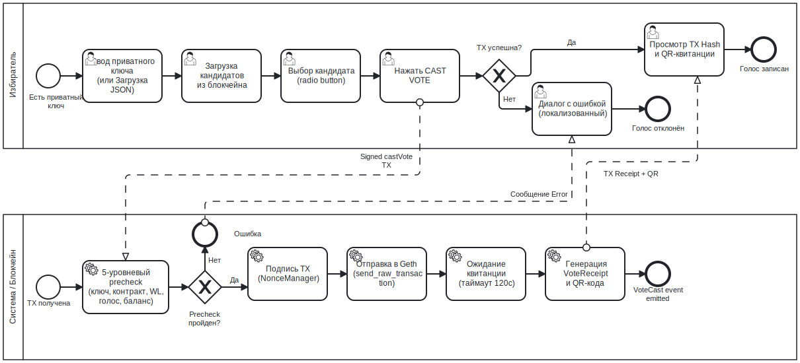

# Фаза подачи голоса BPMN

## Назначение

Данный BPMN-процесс описывает, как голосующий подаёт голос после перехода выборов в этап `ACTIVE`.

Цель — преобразовать решение правомочного голосующего в подтверждённую транзакцию блокчейна и локальную QR-квитанцию.

---

## Контекст

Процесс выполняется через вкладку «Голосование».

Охватывает:

- ввод закрытого ключа голосующего;
- валидацию статуса голосующего;
- выбор кандидата;
- предварительные проверки перед голосованием;
- отправку подписанной транзакции;
- генерацию квитанции.

---

## Диаграмма



---

## Участники и дорожки

| Участник | Ответственность |
|---|---|
| Голосующий | Предоставляет закрытый ключ и выбирает одного кандидата |
| MYCELIUM CORE UI | Отображает статус, кандидатов и квитанцию |
| Application/Core Services | Валидирует и отправляет транзакцию голосования |
| Контракт VotingCore | Обеспечивает соблюдение правил белого списка, этапности, допустимости кандидатов и защиты от двойного голосования |
| Локальный Geth | Подтверждает транзакцию и формирует квитанцию |

---

## Начальное событие

Процесс запускается, когда голосующий открывает вкладку «Голосование» и вводит закрытый ключ.

Типичное предусловие:

```text
VotingCore.stage == ACTIVE
```

---

## Основной поток

1. Голосующий вводит или загружает закрытый ключ.
2. Интерфейс получает адрес Ethereum.
3. Система загружает статус голосующего:
   - белый список;
   - факт голосования;
   - этап;
   - баланс.
4. Голосующий загружает список кандидатов.
5. Голосующий выбирает одного кандидата.
6. Голосующий нажимает **Подать голос**.
7. Система выполняет предварительную валидацию перед голосованием.
8. При успешной валидации фоновый рабочий процесс отправляет транзакцию.
9. `VotingCore.castVote()` обеспечивает соблюдение ограничений на уровне цепочки.
10. Geth подтверждает транзакцию.
11. Система формирует `VoteReceipt`.
12. Интерфейс отображает хэш транзакции и QR-квитанцию.
13. Поле ввода закрытого ключа очищается.

---

## Точки принятия решений

### Контракт активен?

Если контракт не находится в состоянии `ACTIVE` — голосование заблокировано.

---

### Голосующий в белом списке?

Если голосующий не включён в белый список — транзакция не допускается.

---

### Уже проголосовал?

Если `hasVoted` равно true — голосующий не может подать повторный голос.

---

### Достаточно средств?

Если голосующий не может оплатить газ — транзакция не отправляется.

---

## Завершающее событие

Процесс завершается, когда:

```text
VoteReceipt отображена
```

либо когда валидация не пройдена и пользователь получает понятное сообщение.

---

## Сопоставление с реализацией

| Элемент BPMN | Реализация |
|---|---|
| Ввод ключа | `VoteTab` |
| Статус голосующего | `AppController.precheck_vote()` и вспомогательные методы статуса голосующего |
| Выбор кандидата | Переключатели `VoteTab` |
| Рабочий процесс голосования | `VoteWorker` |
| Отправка голоса | `AppController.cast_vote()` |
| Транзакция блокчейна | `VotingService.cast_vote()` |
| Обеспечение ограничений на уровне цепочки | `VotingCore.castVote()` |
| QR-квитанция | `src/utils/qr.py`, `VoteReceipt` |

---

## Связанные требования

- FR-VOTE-01 — Ввод закрытого ключа
- FR-VOTE-02 — Загрузка ключа из JSON
- FR-VOTE-03 — Получение адреса
- FR-VOTE-04 — Отображение статуса голосующего
- FR-VOTE-05 — Отображение кандидатов
- FR-VOTE-06 — Выбор одного кандидата
- FR-VOTE-07 — Подача голоса
- FR-VOTE-08 — Блокировка повторного нажатия
- FR-VOTE-09 — Отображение подтверждения транзакции
- FR-VOTE-10 — Очистка конфиденциальных данных
- FR-REC-01..04 — Квитанция и QR-код

---

## Примечание аналитика

Процесс намеренно разделяет предварительную валидацию перед голосованием и обеспечение ограничений на уровне цепочки.

Предварительная проверка улучшает пользовательский опыт и позволяет избежать заведомо неуспешных транзакций, однако смарт-контракт остаётся окончательным арбитром.

---

## Известные ограничения

- Голосование не является анонимным.
- Обладатель закрытого ключа контролирует голос.
- QR-квитанция может раскрывать метаданные транзакции.
- Данный процесс предназначен исключительно для использования в локальной песочнице.

---

## Источник

[Источник BPMN](../sources/bpmn/voting-cast-phase.ru.bpmn)