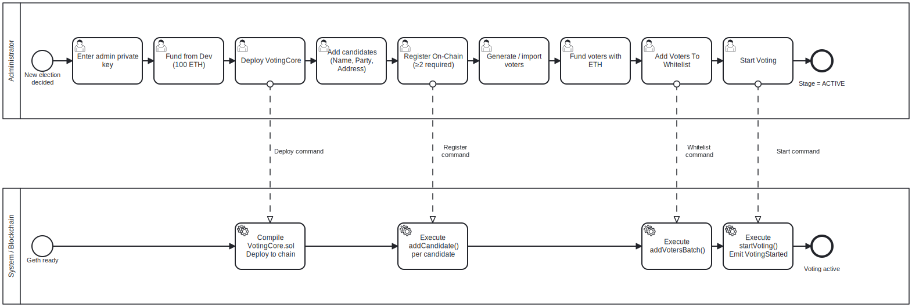

# Voting Setup Phase BPMN

## Purpose

This BPMN process describes the preparation phase of a voting session before
the first vote can be cast.

The goal of this process is to move the system from an empty local sandbox
state to a prepared `SETUP` contract state where candidates and voters are
registered on-chain and voting can be started.

---

## Context

The process is executed by the Administrator through the Admin tab.

It covers:

- admin account preparation;
- contract deployment;
- candidate registration;
- voter generation or import;
- voter funding;
- whitelist registration;
- transition from `SETUP` to `ACTIVE`.

This is a business process view. It intentionally hides low-level Web3 calls
and focuses on roles, decisions and system outcomes.

---

## Diagram



---

## Participants and Lanes

| Participant | Responsibility |
|---|---|
| Administrator | Provides admin key, prepares candidates and voters, starts voting |
| MYCELIUM CORE UI | Collects input, validates basic user actions, starts workers |
| Application/Core Services | Compiles, deploys, validates and sends blockchain transactions |
| Local Geth / VotingCore | Executes contract transactions and stores on-chain state |

---

## Start Event

The process starts when the Administrator decides to create or prepare a new
voting session.

Typical entry point:

```text
Application started -> Admin tab opened -> Contract not deployed
```

---

## Main Flow

1. Administrator enters or loads the admin private key.
2. System checks whether the admin account has enough ETH.
3. If required, Administrator funds the admin account from the local Geth dev account.
4. Administrator deploys `VotingCore`.
5. System compiles the contract and sends the deployment transaction.
6. System stores the deployed contract address in the active session context.
7. Administrator adds at least two candidates.
8. Administrator registers candidates on-chain.
9. Administrator generates or imports voters.
10. Administrator funds voters for gas.
11. Administrator adds voters to whitelist.
12. System registers whitelist voters on-chain.
13. Administrator starts voting.
14. Contract stage changes from `SETUP` to `ACTIVE`.

---

## Decision Points

### Admin account funded?

If the admin account has no ETH, deployment and write operations cannot proceed.

Resolution:

- use **Fund from Dev** in dev mode;
- or provide an already funded admin key.

---

### Candidate count valid?

The contract requires at least two candidates before voting can start.

Resolution:

- add more candidates;
- ensure candidate addresses are valid and unique.

---

### Whitelist populated?

The UI prevents starting voting when whitelist is empty because no voter would
be able to cast a vote.

Resolution:

- generate or import voters;
- add them to whitelist.

---

## End Event

The process ends when:

```text
VotingCore.stage == ACTIVE
```

At this point:

- candidates are frozen;
- whitelist is frozen;
- voters can cast votes;
- setup operations are no longer allowed.

---

## Implementation Mapping

| BPMN Element | Implementation |
|---|---|
| Deploy contract | `DeployWorker`, `AppController.deploy_contract()`, `VotingService.deploy_contract()` |
| Add candidate | `RegisterCandidatesWorker`, `AppController.add_candidate()` |
| Generate voters | `AppController.generate_voters()` |
| Import voters | `AppController.import_voters()` |
| Fund voters | `FundVotersWorker`, `VotingService.fund_account()` |
| Whitelist voters | `WhitelistWorker`, `AppController.whitelist_voters()` |
| Start voting | `StageWorker`, `VotingService.start_voting()` |
| On-chain state | `contracts/VotingCore.sol` |

---

## Related Requirements

- FR-DEP-01 — Compile one contract
- FR-DEP-02 — Deploy from UI
- FR-ADM-01..07 — Candidate management
- FR-ADM-08..14 — Voter and whitelist management
- FR-STAGE-01 — Start voting
- NFR-ARC-02 — No Web3 logic in UI
- NFR-PERF-02 — Long operations in background workers

---

## Analyst Note

The process is intentionally split into user tasks and service tasks.

The Administrator owns business decisions, while MYCELIUM CORE performs
validation and blockchain execution. This separation matches the application
architecture: UI actions are routed through `AppController` and executed by
services or workers.

---

## Known Limitations

- The process does not provide voter anonymity.
- The admin key is handled in a local demo environment.
- Geth `--dev` is a local sandbox and not a production blockchain network.
- The whitelist step can require multiple transactions for large voter lists.

---

## Source

[BPMN source](../sources/bpmn/voting-setup-phase.bpmn)