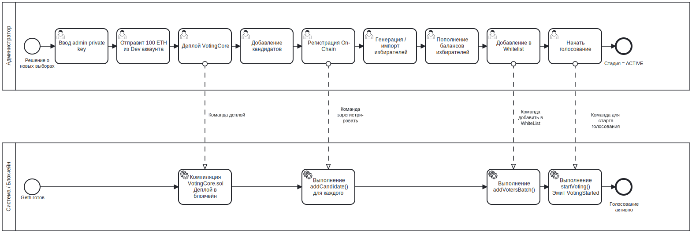

# BPMN подготовки голосования

## Назначение

Этот BPMN-процесс описывает подготовительную фазу сессии голосования до
момента, когда первый голос может быть отправлен.

Цель процесса — перевести систему из пустого локального sandbox-состояния в
подготовленное состояние контракта `SETUP`, где кандидаты и voters
зарегистрированы on-chain, а голосование готово к старту.

---

## Контекст

Процесс выполняется Администратором через вкладку Admin.

Он охватывает:

- подготовку admin account;
- deploy контракта;
- регистрацию кандидатов;
- генерацию или импорт voters;
- funding voters;
- whitelist registration;
- переход из `SETUP` в `ACTIVE`.

Это бизнес-представление процесса. Оно намеренно скрывает низкоуровневые
Web3-вызовы и фокусируется на ролях, решениях и результатах системы.

---

## Диаграмма



---

## Участники и дорожки

| Участник | Ответственность |
|---|---|
| Администратор | Предоставляет admin key, подготавливает кандидатов и voters, запускает голосование |
| MYCELIUM CORE UI | Собирает ввод, выполняет базовую UI validation, запускает workers |
| Application/Core Services | Компилируют, деплоят, валидируют и отправляют blockchain transactions |
| Local Geth / VotingCore | Выполняет contract transactions и хранит on-chain state |

---

## Начальное событие

Процесс начинается, когда Администратор решает создать или подготовить новую
сессию голосования.

Типичная точка входа:

```text
Application started -> Admin tab opened -> Contract not deployed
```

---

## Основной поток

1. Администратор вводит или загружает admin private key.
2. Система проверяет, достаточно ли ETH у admin account.
3. Если требуется, Администратор пополняет admin account с локального Geth dev account.
4. Администратор разворачивает `VotingCore`.
5. Система компилирует контракт и отправляет deployment transaction.
6. Система сохраняет deployed contract address в active session context.
7. Администратор добавляет минимум двух кандидатов.
8. Администратор регистрирует кандидатов on-chain.
9. Администратор генерирует или импортирует voters.
10. Администратор финансирует voters для оплаты gas.
11. Администратор добавляет voters в whitelist.
12. Система регистрирует whitelist voters on-chain.
13. Администратор запускает голосование.
14. Стадия контракта меняется с `SETUP` на `ACTIVE`.

---

## Точки принятия решений

### Admin account имеет нулевой баланс?

Если у admin account нет ETH, deploy и write operations невозможны.

Решение:

- использовать **Fund from Dev** в dev mode;
- или предоставить уже профинансированный admin key.

---

### Количество кандидатов имеет валидное значение?

Контракт требует минимум двух кандидатов перед стартом голосования.

Решение:

- добавить кандидатов;
- убедиться, что candidate addresses валидны и уникальны.

---

### Whitelist опубликован?

UI предотвращает старт голосования при пустом whitelist, потому что ни один
voter не сможет проголосовать.

Решение:

- сгенерировать или импортировать voters;
- добавить их в whitelist.

---

## Завершающее событие

Процесс завершается, когда:

```text
VotingCore.stage == ACTIVE
```

В этот момент:

- candidates заморожены;
- whitelist заморожен;
- voters могут голосовать;
- setup operations больше недоступны.

---

## Сопоставление с реализацией

| BPMN Element | Реализация |
|---|---|
| Deploy contract | `DeployWorker`, `AppController.deploy_contract()`, `VotingService.deploy_contract()` |
| Add candidate | `RegisterCandidatesWorker`, `AppController.add_candidate()` |
| Generate voters | `AppController.generate_voters()` |
| Import voters | `AppController.import_voters()` |
| Fund voters | `FundVotersWorker`, `VotingService.fund_account()` |
| Whitelist voters | `WhitelistWorker`, `AppController.whitelist_voters()` |
| Start voting | `StageWorker`, `VotingService.start_voting()` |
| On-chain state | `contracts/VotingCore.sol` |

---

## Связанные требования

- FR-DEP-01 — Компиляция одного контракта
- FR-DEP-02 — Deploy из UI
- FR-ADM-01..07 — Управление кандидатами
- FR-ADM-08..14 — Управление voters и whitelist
- FR-STAGE-01 — Старт голосования
- NFR-ARC-02 — Отсутствие Web3-логики в UI
- NFR-PERF-02 — Длительные операции в background workers

---

## Примечание аналитика

Процесс намеренно разделён на user tasks и service tasks.

Администратор отвечает за бизнес-решения, а MYCELIUM CORE выполняет validation
и blockchain execution. Это соответствует архитектуре приложения: UI actions
проходят через `AppController` и выполняются services или workers.

---

## Известные ограничения

- Процесс не обеспечивает анонимность voters.
- Admin key используется в локальной demo-среде.
- Geth `--dev` является локальным sandbox, а не production blockchain network.
- Whitelist step может требовать несколько транзакций для больших списков voters.

---

## Источник

[BPMN source](../sources/bpmn/voting-setup-phase.ru.bpmn)