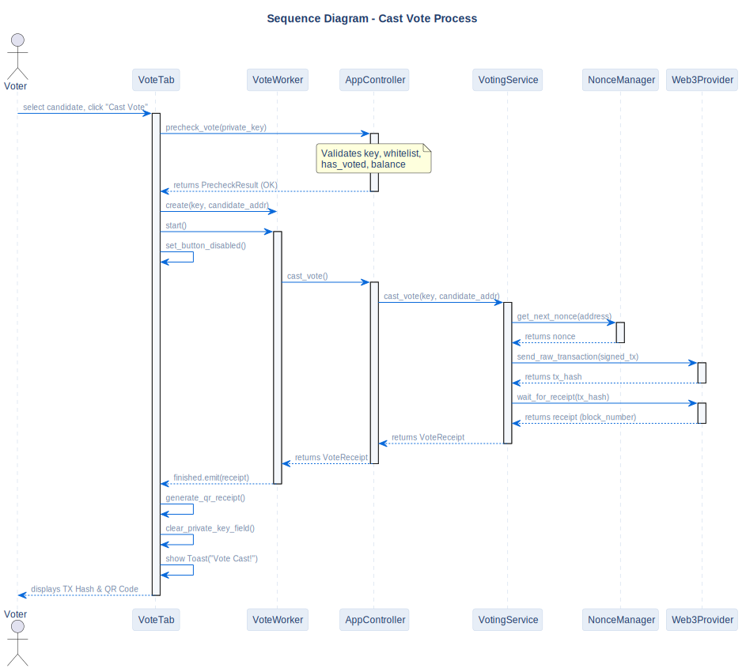

# Vote Casting Scenario

## Description
This sequence diagram illustrates the full vote casting cycle: from voter authentication using a private key to local validation, blockchain execution, and generation of the final QR receipt.

## Diagram

## Architectural Rationale
**Why it is designed this way:**

- **Fail-Fast Principle (Pre-validation):** Before initiating network requests or signing a transaction, the `AppController` performs strict local validation (`precheck_vote`), immediately blocking invalid requests. This reduces UI wait time and prevents gas from being wasted on transactions that would be rejected by the contract anyway.
- **Asynchronous Execution (QThread):** The actual signing and submission of the transaction are delegated to a background `VoteWorker`. The main UI thread is freed immediately, preventing the application from freezing while waiting for block mining (takes ~5 seconds in dev mode).
- **Isolated Receipt Generation:** The QR code and receipt data are generated only after a confirmed block receipt is received from the network. This guarantees that the UI does not display false-positive success messages.
- **VoterStatusWorker (v1.0.1):** Voter status (whitelist, balance, has_voted) is queried asynchronously via `VoterStatusWorker` with a 600ms debounce. Prior to v1.0.1, these 3 RPC calls blocked the UI on every keystroke.

## References

- **Code:** `src/core/precheck.py`, `src/ui/tabs/vote_tab.py`, `src/ui/workers/vote_worker.py`
- **Source:** `src/diagrams/sources/uml/sequence/cast-vote.puml`