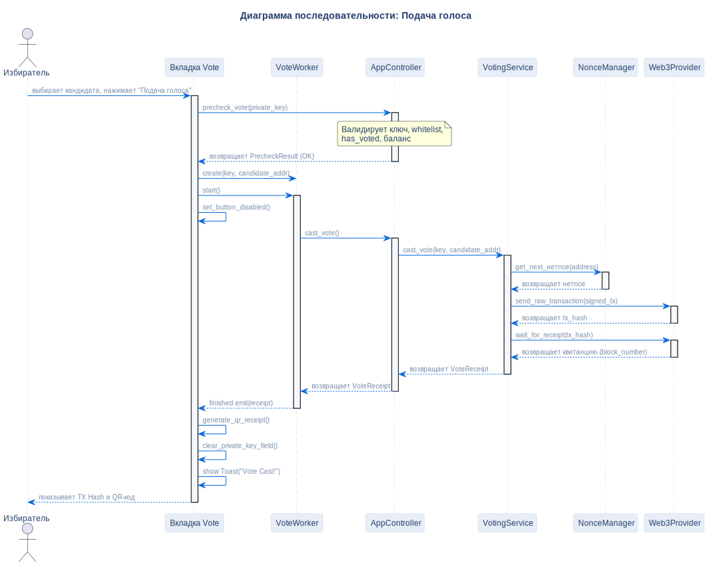

# Сценарий подачи голоса

## Описание
Эта диаграмма последовательности иллюстрирует полный цикл подачи голоса: от аутентификации избирателя приватным ключом до локальной валидации, выполнения в блокчейне и генерации финальной QR-квитанции.

## Диаграмма

## Архитектурное обоснование
**Почему спроектировано именно так:**

- **Принцип Fail-Fast (Предварительная валидация):** Прежде чем инициировать сетевые запросы или подписывать транзакцию, `AppController` выполняет строгую локальную проверку (`precheck_vote`), что мгновенно блокирует невалидные запросы, экономя время ожидания UI и предотвращая сжигание газа на транзакции, которые всё равно будут отклонены контрактом.
- **Асинхронное выполнение (QThread):** Фактическое подписание и отправка транзакции делегируются фоновому `VoteWorker`. Главный поток UI немедленно освобождается, предотвращая зависание приложения во время ожидания майнинга блока (занимает ~5 секунд в dev-режиме).
- **Изолированная генерация квитанции:** QR-код и данные квитанции формируются после получения подтверждённой квитанции блока от сети. Гарантирует, что UI не покажет ложноположительное сообщение об успехе.
- **VoterStatusWorker (v1.0.1):** Статус избирателя (whitelist, balance, has_voted) запрашивается асинхронно через `VoterStatusWorker` с дебаунсом 600мс. До v1.0.1 эти 3 RPC-вызова блокировали UI при каждом нажатии клавиши.

## Ссылки

- **Код:** `src/core/precheck.py`, `src/ui/tabs/vote_tab.py`, `src/ui/workers/vote_worker.py`
- **Источник:** `src/diagrams/sources/uml/sequence/cast-vote.puml`