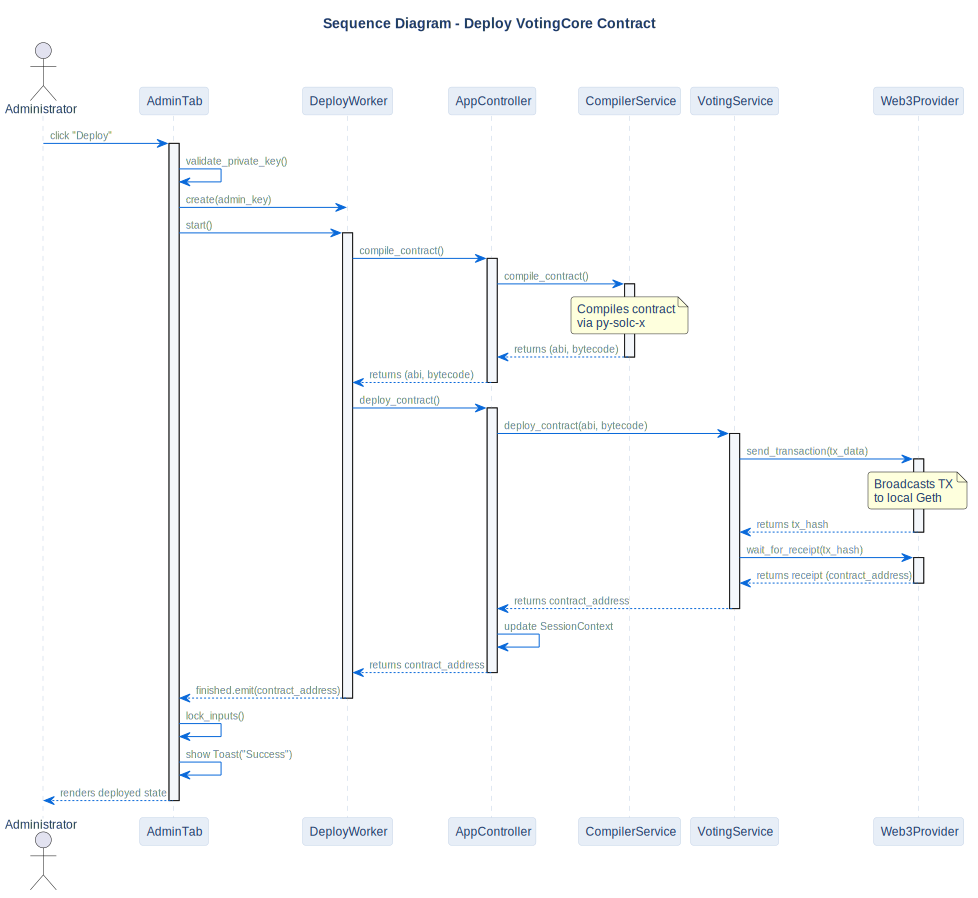

# Deploy Contract Sequence

## Description
This sequence diagram illustrates the step-by-step process of compiling and deploying the `VotingCore` smart contract from the Administrator's UI.

## Diagram

## Note / Architectural Decision

- **Asynchronous Execution:** Compilation and deployment are executed inside a background QThread (`DeployWorker`). This keeps the PyQt6 GUI responsive.
- **Unidirectional Calls:** The UI never talks to Web3. It requests the action through `AppController`, which coordinates the Services.

## References

- **Code:** `src/core/app_controller.py`, `src/ui/tabs/admin_tab.py`
- **ADR:** [ADR-006 (Layered Architecture)](../../architecture/decisions/adr-006-layered-architecture.md)
- **Source:** `src/diagrams/sources/uml/sequence/deploy-contract.puml`