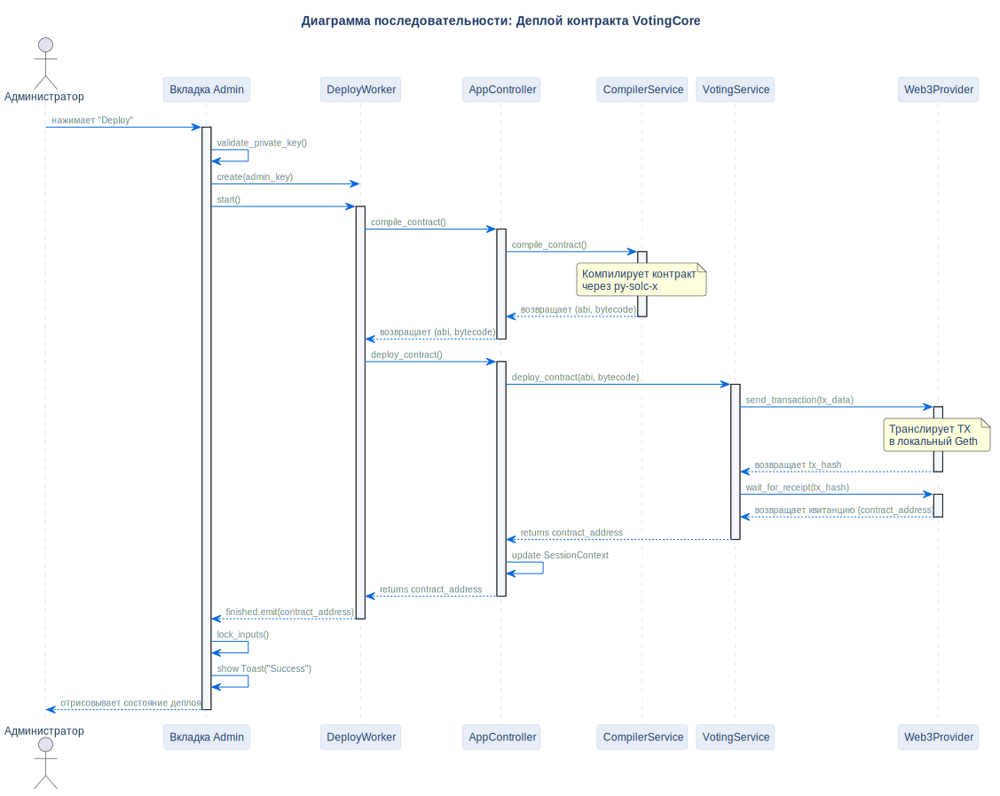

# Сценарий деплоя контракта

## Описание
Эта диаграмма последовательности иллюстрирует пошаговый процесс компиляции и развёртывания смарт-контракта `VotingCore` из интерфейса администратора.

## Диаграмма

## Нота / Архитектурное решение

- **Асинхронное выполнение:** Компиляция и деплой выполняются в фоновом потоке QThread (`DeployWorker`), что сохраняет отзывчивость интерфейса PyQt6.
- **Однонаправленные вызовы:** Слой UI никогда не обращается к Web3 напрямую. Он запрашивает действие через `AppController`, который координирует работу сервисов.

## Ссылки

- **Код:** `src/core/app_controller.py`, `src/ui/tabs/admin_tab.py`
- **ADR:** [ADR-006 (Слоистая архитектура)](../../architecture/decisions/adr-006-layered-architecture.ru.md)
- **Источник:** `src/diagrams/sources/uml/sequence/deploy-contract.puml`