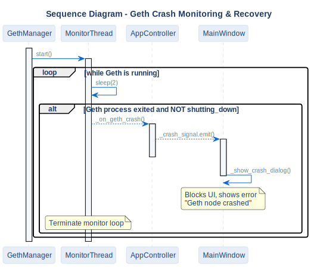

# Geth Crash Recovery Sequence

## Description
This sequence diagram details the fault-tolerance mechanism. It shows how the system monitors the background Geth process and gracefully halts UI operations if the blockchain node crashes unexpectedly.

## Diagram

## Architectural Intent
**Why we designed it this way:**

- **Thread-Safe UI Updates:** The `MonitorThread` runs continuously in the background. However, PyQt6 strictly forbids updating GUI elements from background threads. To solve this, the monitor emits a custom Qt signal (`_crash_signal`), safely delegating the UI lockdown to the main thread.
- **Intentional Shutdown Distinction:** The system uses a `_shutting_down` flag to distinguish between an expected application exit and an abnormal node crash. This prevents false alarms when the user intentionally closes the app or resets the blockchain.
- **Immediate Operation Blocking:** Upon detecting a crash, the UI is immediately locked with a modal dialog. This prevents the user from initiating new RPC calls (like voting or auditing) which would otherwise hang or result in confusing timeout errors.

## References

- **Code:** `src/core/geth_manager.py`, `src/ui/main_window.py`
- **Source:** `src/diagrams/sources/uml/sequence/geth-crash-recovery.puml`