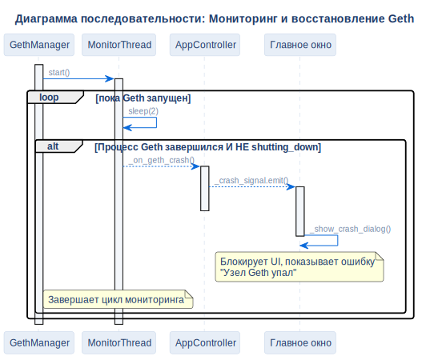

# Сценарий обработки крэша Geth

## Описание
Эта диаграмма последовательности детализирует механизм отказоустойчивости. Она показывает, как система мониторит фоновый процесс Geth и корректно блокирует операции интерфейса при внезапном падении узла блокчейна.

## Диаграмма

## Архитектурное обоснование
**Почему спроектировано именно так:**

- **Потокобезопасное обновление UI:** `MonitorThread` непрерывно работает в фоне. Однако PyQt6 строго запрещает обновление элементов GUI из фоновых потоков. Для решения этой проблемы монитор генерирует кастомный Qt-сигнал (`_crash_signal`), безопасно делегируя блокировку UI главному потоку.
- **Распознавание намеренной остановки:** Система использует флаг `_shutting_down`, чтобы отличать штатное завершение работы от аварийного падения узла. Это предотвращает ложные срабатывания, когда пользователь намеренно закрывает приложение или сбрасывает блокчейн.
- **Мгновенная блокировка операций:** При обнаружении сбоя UI немедленно блокируется модальным окном, что не позволяет пользователю инициировать новые RPC-вызовы (голосование, аудит), которые в противном случае зависли бы или выдали непонятные ошибки таймаута.

## Ссылки

- **Код:** `src/core/geth_manager.py`, `src/ui/main_window.py`
- **Источник:** `src/diagrams/sources/uml/sequence/geth-crash-recovery.puml`