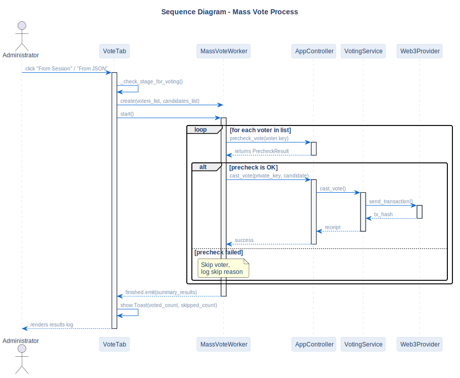

# Mass Vote Sequence

## Description
This diagram describes the automated bulk voting execution used for performance and load testing of the local node.

## Diagram

## Note / Architectural Decision

- **Graceful Error Handling:** If a single voter in the bulk list fails the validation check, they are skipped without aborting the entire process, preventing application crashes.

## References

- **Code:** `src/ui/workers/mass_vote_worker.py`
- **Source:** `src/diagrams/sources/uml/sequence/mass-vote.puml`