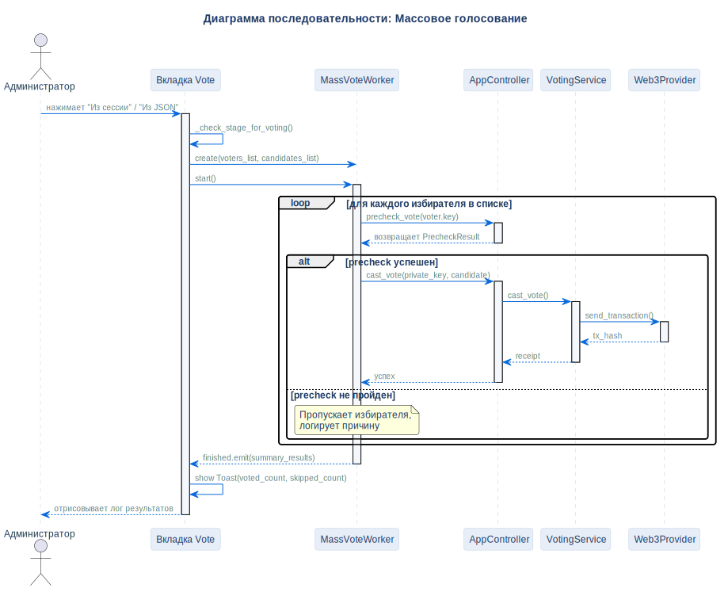

# Сценарий массового голосования

## Описание
Эта диаграмма описывает процесс автоматического пакетного голосования, используемого для нагрузочного тестирования локального узла блокчейна.

## Диаграмма

## Нота / Архитектурное решение

- **Безопасная обработка ошибок:** Если один из избирателей в пакете не проходит проверку, он пропускается без прерывания общего процесса, что исключает аварийную остановку приложения.

## Ссылки

- **Код:** `src/ui/workers/mass_vote_worker.py`
- **Источник:** `src/diagrams/sources/uml/sequence/mass-vote.puml`