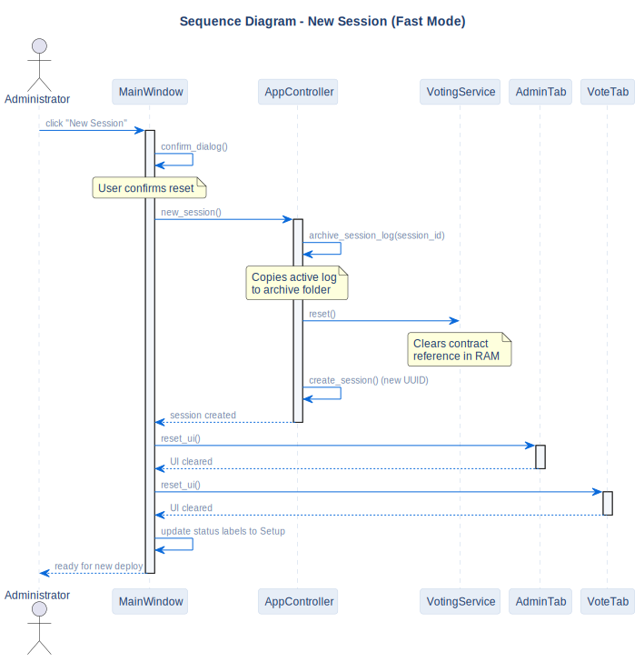

# New Session Sequence

## Description
This sequence diagram shows how the system archives active logs and cleans the current UI state to initiate a new voting contract in the same blockchain environment.

## Diagram

## Note / Architectural Decision

- **RAM Reset Only:** This "Fast Mode" reset only clears the references in memory, allowing previously deployed contracts to remain readable in the blockchain history.

## References

- **Code:** `src/ui/main_window.py`
- **Source:** `src/diagrams/sources/uml/sequence/new-session.puml`