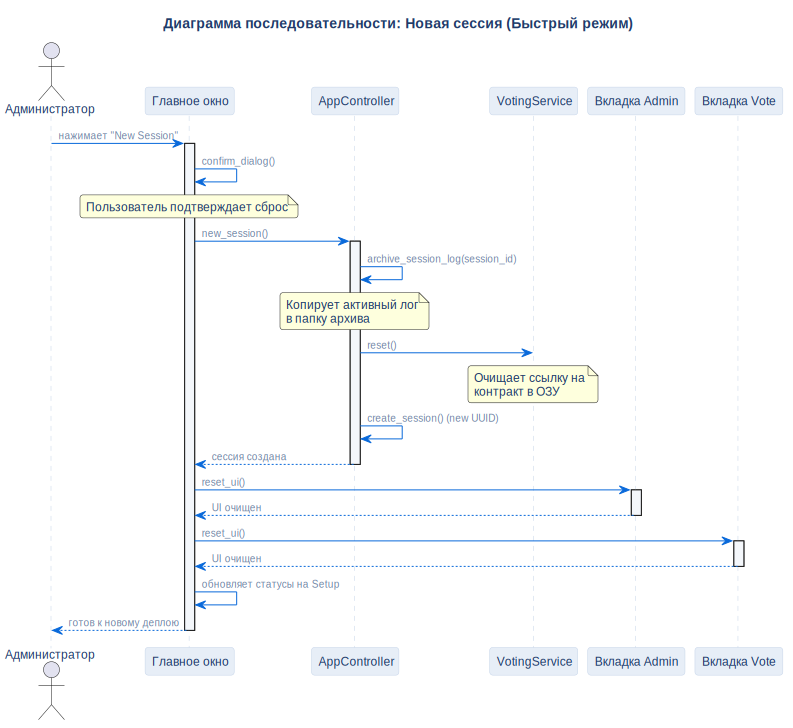

# Сценарий новой сессии

## Описание
Эта диаграмма последовательности показывает, как система архивирует активные логи и очищает состояние UI для развёртывания нового контракта в той же блокчейн-среде.

## Диаграмма

## Нота / Архитектурное решение

- **Сброс только в RAM:** Этот быстрый режим сброса очищает только ссылки в оперативной памяти, позволяя ранее развёрнутым контрактам оставаться доступными в истории блокчейна.

## Ссылки

- **Код:** `src/ui/main_window.py`
- **Источник:** `src/diagrams/sources/uml/sequence/new-session.puml`