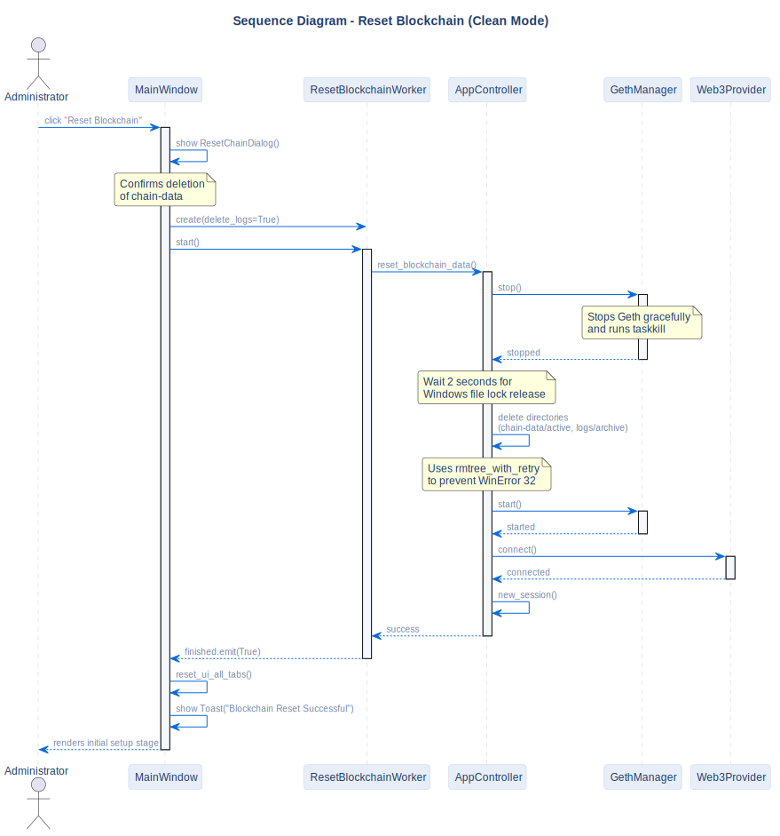

# Reset Blockchain Sequence

## Description
This diagram represents the "Clean Mode" reset workflow: stopping Geth, wiping all active blockchain databases, and restarting Geth with a fresh genesis block.

## Diagram

## Note / Architectural Decision

- **WinError 32 Prevention:** We added a strict 2-second sleep duration after Geth termination to allow the Windows Operating System to release handles on DB files before deletion.

## References

- **Code:** `src/core/app_controller.py`, `src/ui/widgets/reset_chain_dialog.py`
- **Source:** `src/diagrams/sources/uml/sequence/reset-blockchain.puml`