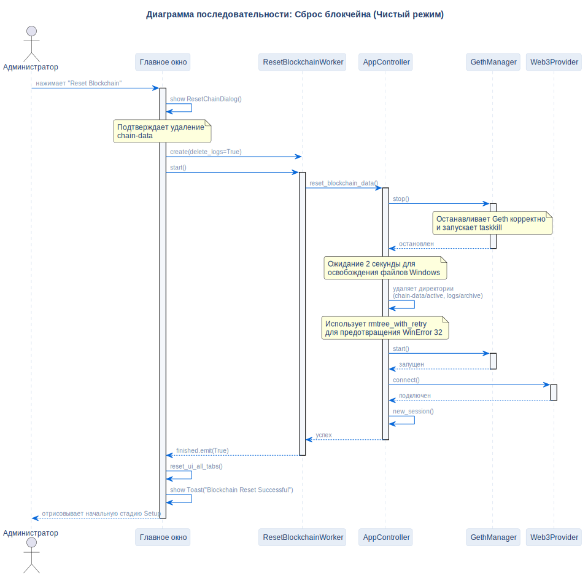

# Сценарий сброса блокчейна

## Описание
Эта диаграмма представляет процесс полной очистки блокчейна: остановку Geth, стирание папок базы данных и перезапуск узла со свежим генезис-блоком.

## Диаграмма

## Нота / Архитектурное решение

- **Предотвращение WinError 32:** Добавлено строгое время ожидания в 2 секунды после завершения Geth, чтобы дать ОС Windows время освободить дескрипторы файлов базы данных перед удалением.

## Ссылки

- **Код:** `src/core/app_controller.py`, `src/ui/widgets/reset_chain_dialog.py`
- **Источник:** `src/diagrams/sources/uml/sequence/reset-blockchain.puml`