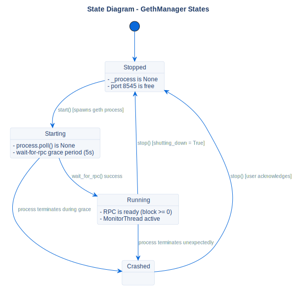

# GethManager States

## Description
This state diagram represents the process management states of Geth, overseen by the `GethManager` class.

## Diagram

## References

- **Code:** `src/core/geth_manager.py`
- **Source:** `src/diagrams/sources/uml/state/geth-states.puml`