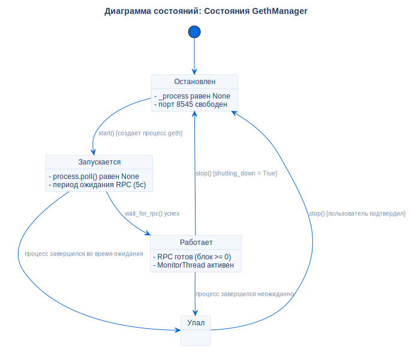

# Состояния процесса Geth

## Описание
Эта диаграмма состояний представляет фазы управления процессом Geth, контролируемые классом `GethManager`.

## Диаграмма

## Ссылки

- **Код:** `src/core/geth_manager.py`
- **Источник:** `src/diagrams/sources/uml/state/geth-states.puml`