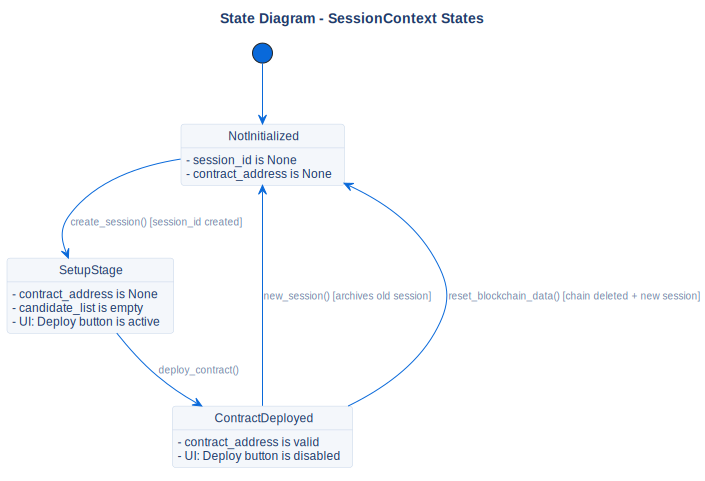

# SessionContext States

## Description
This state diagram illustrates the lifecycle of the in-memory session context managed by the application.

## Diagram

## References

- **Code:** `src/core/models.py` (SessionContext)
- **Source:** `src/diagrams/sources/uml/state/session-states.puml`