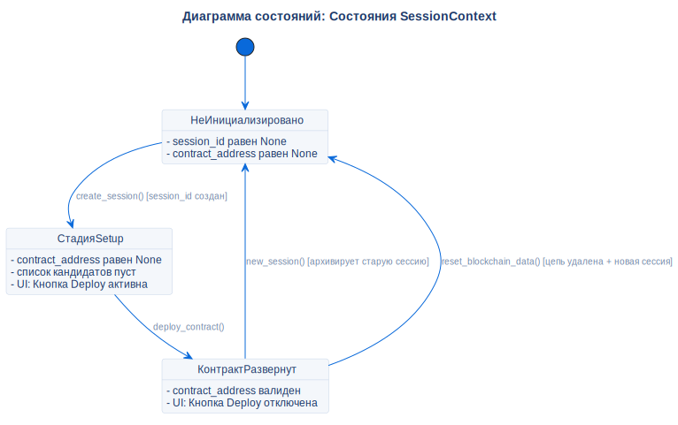

# Состояния контекста сессии

## Описание
Эта диаграмма состояний иллюстрирует жизненный цикл сессионного контекста в оперативной памяти приложения.

## Диаграмма

## Ссылки

- **Код:** `src/core/models.py` (SessionContext)
- **Источник:** `src/diagrams/sources/uml/state/session-states.puml`