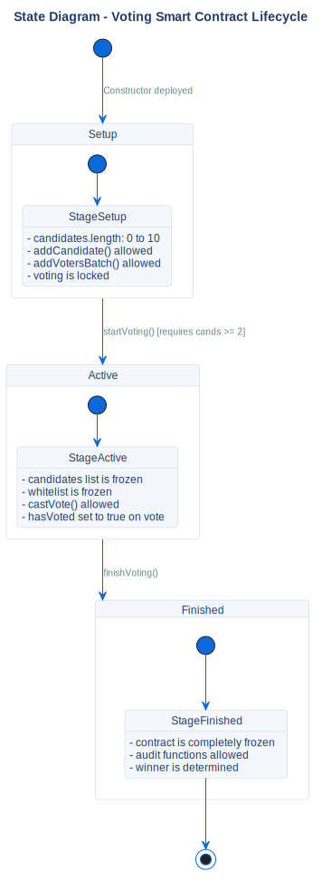

# Voting Contract Lifecycle

## Description
This state diagram represents the strict, one-way state transitions of the `VotingCore` smart contract.

## Diagram

## Architectural Intent
**Why we designed it this way:**

- **Cryptographic Irreversibility:** The state machine strictly moves forward: `Setup` -> `Active` -> `Finished`. Once a phase is transitioned, it is impossible to go back. This guarantees that candidates cannot be altered during voting, and votes cannot be cast after the election has concluded.
- **One Session = One Contract:** To prevent state contamination and replay attacks, we abandoned the idea of a "Reset Election" function inside the smart contract. Instead, starting a new election requires deploying a completely new contract instance.
- **Audit Stability:** The `Finished` state acts as a terminal freeze state. This ensures that when the `AuditService` runs its cryptographic checks, the underlying blockchain data is immutable and cannot be tampered with mid-audit.

## References

- **Smart Contract:** `contracts/VotingCore.sol`
- **Source:** `src/diagrams/sources/uml/state/voting-lifecycle.puml`