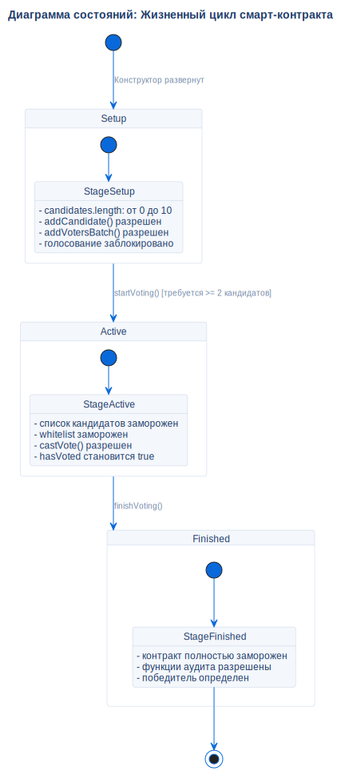

# Жизненный цикл контракта голосования

## Описание
Эта диаграмма состояний представляет строгие, однонаправленные переходы стадий смарт-контракта `VotingCore`.

## Диаграмма

## Архитектурное обоснование
**Почему спроектировано именно так:**

- **Криптографическая необратимость:** Конечный автомат движется строго вперед: `Setup` -> `Active` -> `Finished`. Возврат на предыдущую стадию невозможен. Это гарантирует, что кандидаты не могут быть изменены во время голосования, а голоса не могут быть поданы после его завершения.
- **Одна сессия = Один контракт:** Чтобы предотвратить "загрязнение" состояния и атаки повторного воспроизведения, мы отказались от функции "Сброс выборов" внутри смарт-контракта. Вместо этого запуск новых выборов требует развертывания совершенно нового экземпляра контракта.
- **Стабильность аудита:** Состояние `Finished` является терминальным (замороженным). Это гарантирует, что когда `AuditService` выполняет свои криптографические проверки, базовые данные блокчейна неизменны и не могут быть подделаны прямо в процессе аудита.

## Ссылки

- **Контракт:** `contracts/VotingCore.sol`
- **Источник:** `src/diagrams/sources/uml/state/voting-lifecycle.puml`