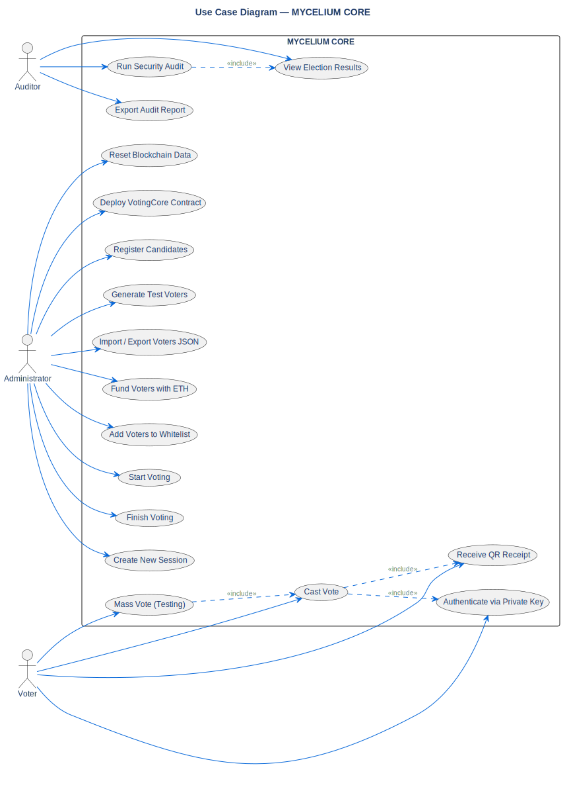

# System Use Cases

## Description

This UML Use Case diagram shows all primary interactions between
the three system actors (Administrator, Voter, Auditor) and the
**MYCELIUM CORE** application.

## Diagram

## Note / Architectural Decision

**Why we designed it this way:**

- **Three distinct actors:** The system enforces role separation at
  the smart contract level. The Administrator owns the contract and
  controls stages. Voters authenticate with private keys. Auditors
  perform read-only verification.

- **Include relationships:** `Cast Vote` always includes authentication
  and receipt generation. `Mass Vote` delegates to `Cast Vote` per
  voter. `Run Audit` always produces results.

## References

- **ADR:** [ADR-004 (One Session One Vote)](../../architecture/decisions/adr-004-one-session-one-vote.md)
- **ADR:** [ADR-006 (Layered Architecture)](../../architecture/decisions/adr-006-layered-architecture.md)
- **SRS:** Sections 4.1–4.3 (User Roles), 10.1–10.11 (Functional Requirements)
- **Source:** `src/diagrams/sources/uml/usecase/system-use-cases.puml`