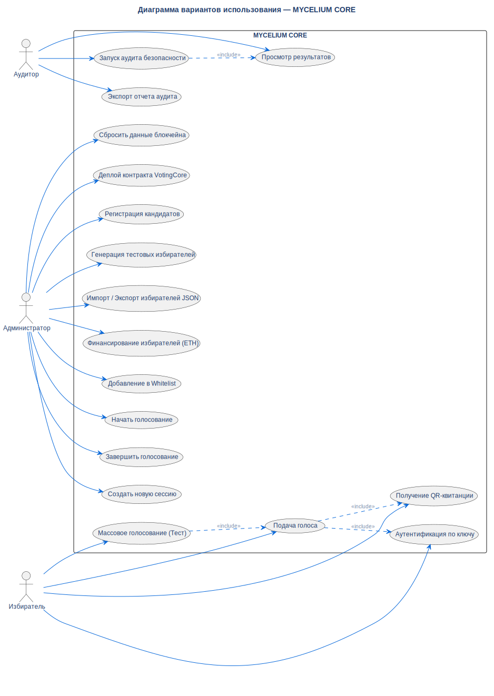

# Диаграмма вариантов использования

## Описание

Эта UML-диаграмма вариантов использования показывает все основные
взаимодействия между тремя актёрами системы (Администратор, Избиратель,
Аудитор) и приложением **MYCELIUM CORE**.

## Диаграмма

## Нота / Архитектурное решение

**Почему спроектировано именно так:**

- **Три отдельных актёра:** Система обеспечивает разделение ролей на
  уровне смарт-контракта. Администратор владеет контрактом и управляет
  стадиями. Избиратели аутентифицируются приватными ключами. Аудиторы
  выполняют проверки только на чтение.

- **Связи включения (include):** `Подача голоса` всегда включает
  аутентификацию и генерацию квитанции. `Массовое голосование` делегирует
  к `Подача голоса` для каждого избирателя. `Запуск аудита` всегда
  формирует результаты.

## Ссылки

- **ADR:** [ADR-004 (Одна сессия — Одно голосование)](../../architecture/decisions/adr-004-one-session-one-vote.md)
- **ADR:** [ADR-006 (Слоистая архитектура)](../../architecture/decisions/adr-006-layered-architecture.md)
- **SRS:** Разделы 4.1–4.3 (Роли пользователей), 10.1–10.11 (Функциональные требования)
- **Источник:** `src/diagrams/sources/uml/usecase/system-use-cases.puml`